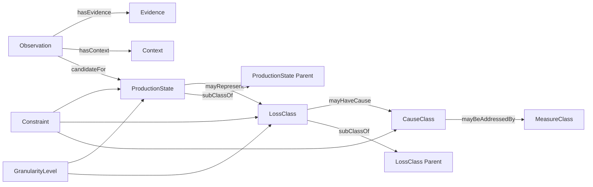
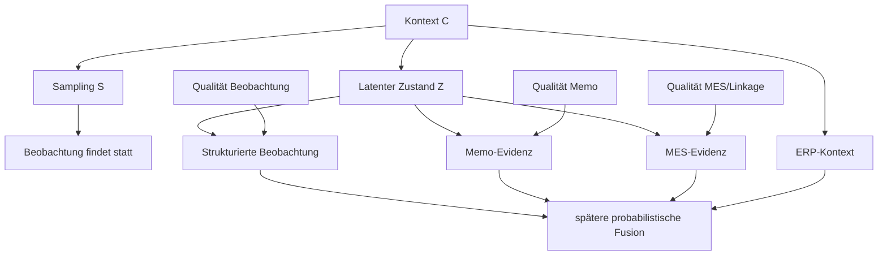

# AP1 – Formale Modellierung des Produktions- und Beobachtungsmodells

**Projekt:** Entwicklung eines unsicherheitsgeführten Mess- und Entscheidungsverfahrens für belastbare Effektivitätskennzahlen und robuste Verbesserungsmaßnahmen in Produktionssystemen  
**Arbeitspaket:** AP1 – Formale Modellierung des Produktions- und Beobachtungsmodells  
**Arbeitsstand:** Vorarbeit / Entwurf v0.1  
**Soll-Zeitfenster laut Projektplan:** Mai–August 2026  
**Aufwand laut Arbeitsplan:** 585 Stunden  
**Rolle im Gesamtvorhaben:** Fachliche und formale Grundlage für AP2, AP3 und später AP5

---

## 0. Kennzeichnung der Inhalte

Damit die Vorarbeit sauber vom bereits festgelegten Projektinhalt getrennt bleibt, werden drei Arten von Aussagen unterschieden:

- **[Quelle]** – direkt aus dem Projektplan übernommen.
- **[Ableitung]** – aus Zielbild, Architektur, AP-Verkettung oder Definition of Done abgeleitet.
- **[Entwurf]** – konkrete Arbeitsausgestaltung für AP1, die im Projektteam geprüft und versioniert beschlossen werden sollte.

Der Projektplan legt für AP1 Zweck, Kernarbeiten, erwartete Ergebnisse und den Fallback bei mangelnder Identifizierbarkeit fest. Die konkrete Ontologie, der Klassenkatalog, die Relationen, Constraints, Granularitätskriterien und die Änderungspolitik sind ausdrücklich noch zu konkretisieren. Dieses Dokument arbeitet genau diese offenen Punkte als belastbaren Startentwurf vor.

---

# 1. Ziel und Rolle von AP1

## 1.1 Zielsetzung

**[Quelle]** AP1 soll ein ontologisches Fachmodell schaffen, das Aktivitäts-, Verlust-, Ursachen- und Maßnahmenklassen sowie deren Relationen und Constraints formal beschreibt. Gleichzeitig soll untersucht werden, welche Granularität mit sparsamen, heterogenen und fehlerbehafteten Beobachtungsdaten überhaupt trennscharf identifizierbar ist.

Das Ergebnis von AP1 ist damit **nicht lediglich ein Klassenkatalog**, sondern ein formalisiertes Beobachtungs- und Zustandsmodell, das festlegt:

1. welche fachlichen Zustände im Projekt unterschieden werden,
2. welche Zustände hierarchisch zusammengehören,
3. welche Relationen zwischen Aktivität, Verlust, Ursache und Maßnahme zulässig sind,
4. welche Informationen eine Beobachtung mindestens enthalten muss,
5. welche Evidenzkanäle später zu einer Klassenzuordnung beitragen können,
6. wann eine feine Klasse nicht ausreichend identifizierbar ist,
7. auf welche gröbere Klasse dann zurückgefallen wird,
8. wie Unsicherheit und Mehrdeutigkeit bereits auf Modellebene erhalten bleiben.

## 1.2 Definition of Done

**[Quelle]** AP1 ist operativ abgeschlossen, wenn AP3 für jede Beobachtung zulässige Kandidatenklassen und Constraints aus AP1 beziehen kann und strittige bzw. nicht trennbare Bereiche explizit als unsicher dokumentiert sind.

**[Ableitung]** Daraus folgt für die technische Übergabe:

- AP1 muss maschinenlesbare IDs für Klassen und Relationen vorgeben.
- Es muss eine Hierarchie geben, damit bei mangelnder Evidenz auf gröbere Klassen zurückgefallen werden kann.
- Das Beobachtungsschema darf keine harte Vorabklassifikation erzwingen.
- Konflikte, unbekannte Zustände und nicht identifizierbare Fälle müssen zulässige Modellzustände sein.
- Die Ontologie muss versioniert werden, da spätere APs auf exakt diese Semantik referenzieren.

---

# 2. Scope und Abgrenzung

## 2.1 Bestandteil von AP1

**[Entwurf]**

AP1 umfasst:

- fachliches Metamodell,
- initialen Klassenkatalog,
- Hierarchie und Granularitätsstufen,
- formale Relationen,
- Constraints,
- Beobachtungsschema,
- konzeptionelle generative Struktur der Sparsity-Erhebung,
- Granularitäts- und Identifizierbarkeitsprüfung,
- Versionierungs- und Änderungspolitik,
- Übergabespezifikation an AP2 und AP3.

## 2.2 Nicht Bestandteil von AP1

Zur Vermeidung von Scope Creep werden folgende Punkte ausdrücklich nachgelagerten Arbeitspaketen zugeordnet:

- Entwicklung der Erfassungs-App → **AP2**
- Sprach-/Text-Klassifikation und Abstain-Kalibrierung → **AP3**
- technische MES-/ERP-Anbindung und Linkage → **AP4**
- bayesianische Fusion und Schätzung latenter Zustände → **AP5**
- finale Effektivitätskennzahlen und Intervallverfahren → **AP6**
- End-to-end-Unsicherheitspropagation → **AP7**
- Wirkungsmodell und Maßnahmenpriorisierung → **AP8/AP9**

AP1 schafft die semantische und formale Grundlage, implementiert diese späteren Methoden aber noch nicht.

---

# 3. Leitprinzipien für das Fachmodell

## 3.1 Unsicherheit wird nicht durch die Ontologie „wegdefiniert“

**[Quelle/Ableitung]** Das Gesamtvorhaben verlangt, dass Unsicherheit nicht durch harte Punktentscheidungen abgeschnitten wird.

Daher gelten für AP1 folgende Modellierungsprinzipien:

1. **Mehrdeutigkeit ist zulässig.**  
   Eine Beobachtung muss mehreren Kandidatenklassen zugeordnet werden können.

2. **„Unbekannt“ ist ein valider Zustand.**  
   Das Modell darf keine erzwungene Feinzuordnung verlangen.

3. **Hierarchie statt Scheingenauigkeit.**  
   Ist eine Unterklasse nicht identifizierbar, wird auf eine gröbere Oberklasse zurückgefallen.

4. **Beobachtung und wahrer Zustand werden getrennt.**  
   Erfasste Merkmale sind Evidenz; sie sind nicht automatisch der tatsächliche Produktionszustand.

5. **Ursache und Maßnahme werden nicht aus einer einzelnen Beobachtung behauptet.**  
   Eine Beobachtung kann Hinweise auf Ursachen liefern; kausale Wirkung ist nicht Bestandteil von AP1.

6. **Provenienz bleibt erhalten.**  
   Jede Information muss ihrem Evidenzkanal zuordenbar bleiben.

---

# 4. Formales Metamodell

## 4.1 Kernobjekte

**[Entwurf]** Das Fachmodell besteht aus folgenden Kernobjekten:

| Objekt | Bedeutung | Beispiel |
|---|---|---|
| `Observation` | einzelne stichprobenartige Beobachtung | Beobachtung an Station 12 um 10:43 Uhr |
| `ProductionState` | fachlich möglicher Produktions-/Aktivitätszustand | Warten auf Material |
| `LossClass` | Verlusttyp, der einem Zustand zugeordnet sein kann | Fluss-/Warteverlust |
| `CauseClass` | mögliche Ursache eines Verlusts | Materialbereitstellung |
| `MeasureClass` | möglicher Maßnahmentyp | Kanban-/Bereitstellungskonzept |
| `Evidence` | Information aus einem Kanal | Memo, MES-Ereignis, ERP-Kontext |
| `Context` | betrieblicher Kontext der Beobachtung | Auftrag, Produkt, Arbeitsplatz |
| `Constraint` | fachliche Zulässigkeitsregel | Klasse nur bei bestimmtem Kontext zulässig |
| `GranularityLevel` | Feinheitsstufe einer Klasse | G1, G2, G3 |

## 4.2 Beziehungssicht



## 4.3 Trennung von Evidenz und Zustand

Die spätere Modellkette soll zwischen beobachteter Evidenz und verborgenem tatsächlichem Zustand unterscheiden.

Für Beobachtung \(i\):

- \(Z_i\): latenter tatsächlicher Produktionszustand,
- \(X_i^{obs}\): strukturierte Beobachtungsmerkmale,
- \(X_i^{memo}\): Sprach-/Textmemo,
- \(X_i^{MES}\): MES-Evidenz,
- \(X_i^{ERP}\): ERP-Kontext,
- \(C_i\): zusätzlicher Kontext,
- \(S_i\): Information über das Stichprobendesign.

**[Entwurf]** AP1 definiert lediglich die Struktur:

\[
p(S_i, Z_i, X_i^{obs}, X_i^{memo}, X_i^{MES}, X_i^{ERP}\mid C_i)
\]

und die zulässigen Abhängigkeiten. Die konkrete probabilistische Parametrisierung und Fusion erfolgt erst in AP5.

Eine mögliche konzeptionelle Faktorisierung lautet:

\[
p(S_i\mid C_i)\cdot p(Z_i\mid C_i)\cdot
\prod_{k \in \{obs,memo,MES,ERP\}}
p(X_i^{k}\mid Z_i,C_i,Q_i^{k})
\]

mit \(Q_i^{k}\) als Qualitäts-/Zuverlässigkeitsinformation des jeweiligen Evidenzkanals.

Diese Struktur verhindert, dass ein beobachtetes Merkmal bereits im Fachmodell mit dem „wahren“ Zustand gleichgesetzt wird.

---

# 5. Initiale Ontologie v0.1

> **Hinweis:** Die folgenden Klassen sind ein **[Entwurf]** für die Startdiskussion. Der Projektplan gibt keine finale Klassenliste vor. Die Klassen müssen in der Granularitätsanalyse gegen reale Anwendungsfälle und verfügbare Evidenz geprüft werden.

## 5.1 Produktions-/Aktivitätszustände

### G0 – unbekannt

- `PS_UNKNOWN` – Zustand nicht ausreichend bestimmbar

### G1 – grobe Ebene

- `PS_PRODUCTIVE` – wertschöpfend / direkt produktiv
- `PS_NECESSARY_SUPPORT` – notwendige unterstützende Tätigkeit
- `PS_LOSS` – Verlustzustand
- `PS_UNKNOWN` – nicht belastbar zuordenbar

### G2 – mittlere Ebene

Unter `PS_NECESSARY_SUPPORT`:

- `PS_SETUP` – Rüsten / Umstellen
- `PS_INSPECTION` – Prüfen / Kontrollieren
- `PS_TRANSPORT` – notwendiger Material-/Objekttransport
- `PS_PLANNED_SUPPORT` – geplante unterstützende Tätigkeit

Unter `PS_LOSS`:

- `PS_WAITING` – Warten / Stillstand ohne produktive Tätigkeit
- `PS_DISTURBANCE` – ungeplante Störung / Unterbrechung
- `PS_REWORK` – Nacharbeit / Fehlerkorrektur
- `PS_UNPLANNED_MAINTENANCE` – ungeplante Instandhaltung / Reparatur
- `PS_PERFORMANCE_DEVIATION` – Leistung unter erwartbarem Niveau
- `PS_UNNECESSARY_MOTION_OR_TRANSPORT` – vermeidbare Bewegung / Transport

### G3 – feine Ebene

Feine Klassen werden nur eingeführt, wenn sie durch die verfügbaren Evidenzkanäle trennbar sind.

Beispielhafte Kandidaten:

- `PS_WAIT_MATERIAL`
- `PS_WAIT_INFORMATION`
- `PS_WAIT_MACHINE`
- `PS_WAIT_PERSONNEL`
- `PS_DISTURB_MACHINE`
- `PS_DISTURB_PROCESS`
- `PS_REWORK_INTERNAL_DEFECT`
- `PS_REWORK_SUPPLIER_DEFECT`

**Granularitätsregel:** G3-Klassen sind optionale Blätter. Ist die Trennung nicht belastbar, bleibt die Ausgabe auf G2.

---

## 5.2 Verlustklassen

**[Entwurf]**

- `LOSS_AVAILABILITY` – Verfügbarkeitsverlust
- `LOSS_PERFORMANCE` – Leistungs-/Geschwindigkeitsverlust
- `LOSS_QUALITY` – Qualitätsverlust
- `LOSS_FLOW_WAIT` – Fluss-/Warteverlust
- `LOSS_CHANGEOVER` – Rüst-/Wechselverlust
- `LOSS_RESOURCE_USE` – vermeidbarer Ressourcen-/Handhabungsverlust
- `LOSS_UNKNOWN` – Verlust vorhanden, Typ unklar

Die Liste ist bewusst schlank zu halten. Sie dient nicht als endgültige KPI-Systematik; die finale Kennzahlendefinition gehört zu AP6.

---

## 5.3 Ursachenklassen

**[Entwurf]**

- `CAUSE_EQUIPMENT` – Maschine / Anlage / Werkzeug
- `CAUSE_MATERIAL` – Material / Bauteil / Verfügbarkeit
- `CAUSE_METHOD_PROCESS` – Methode / Prozessgestaltung / Standard
- `CAUSE_PLANNING_INFORMATION` – Planung / Auftrag / Information
- `CAUSE_QUALITY_INPUT` – Qualitätsproblem im Input
- `CAUSE_LOGISTICS` – Materialfluss / Bereitstellung / Transport
- `CAUSE_ORGANIZATION_PERSONNEL` – Organisation / Rollen / Verfügbarkeit
- `CAUSE_ENVIRONMENT_EXTERNAL` – Umgebung / externer Einfluss
- `CAUSE_UNKNOWN` – Ursache nicht belastbar bestimmbar

Wichtig: Eine Ursache ist in AP1 eine **fachlich zulässige Hypothesenklasse**, keine automatisch bewiesene Kausalität.

---

## 5.4 Maßnahmenklassen

**[Entwurf]**

- `MEASURE_MAINTENANCE`
- `MEASURE_PROCESS_STANDARDIZATION`
- `MEASURE_MATERIAL_LOGISTICS`
- `MEASURE_PLANNING_CONTROL`
- `MEASURE_QUALITY_ASSURANCE`
- `MEASURE_TRAINING_WORK_ORGANIZATION`
- `MEASURE_LAYOUT_FLOW`
- `MEASURE_TECHNICAL_AUTOMATION`
- `MEASURE_DATA_MONITORING`
- `MEASURE_INFORMATION_COLLECTION`

Die Maßnahmenklassen werden in AP1 nur semantisch verankert. Wirkung, Priorisierung und Transfer werden erst in AP8/AP9 behandelt.

---

# 6. Relationen v0.1

## 6.1 Zulässige Relationstypen

**[Entwurf]**

| Relation | Quelle | Ziel | Bedeutung |
|---|---|---|---|
| `subClassOf` | Klasse | Klasse | hierarchische Unterordnung |
| `candidateFor` | Observation | ProductionState | zulässige Kandidatenklasse |
| `hasEvidence` | Observation | Evidence | Evidenzkanal der Beobachtung |
| `hasContext` | Observation | Context | betrieblicher Kontext |
| `mayRepresentLoss` | ProductionState | LossClass | fachlich möglicher Verlusttyp |
| `mayHaveCause` | LossClass | CauseClass | fachlich zulässige Ursache |
| `mayBeAddressedBy` | CauseClass | MeasureClass | fachlich mögliche Maßnahme |
| `requiresEvidence` | Klasse | EvidenceType | Evidenzanforderung für feine Klasse |
| `incompatibleWith` | Klasse | Klasse | gegenseitig unzulässige Kombination |
| `requiresContext` | Klasse | ContextCondition | Kontextbedingung |
| `fallbackTo` | feine Klasse | grobe Klasse | Rückfall bei mangelnder Identifizierbarkeit |

## 6.2 Beispiel

```text
PS_WAIT_MATERIAL
  subClassOf -> PS_WAITING
  mayRepresentLoss -> LOSS_FLOW_WAIT
  mayHaveCause -> CAUSE_MATERIAL
  mayHaveCause -> CAUSE_LOGISTICS
  fallbackTo -> PS_WAITING
```

---

# 7. Formale Constraints v0.1

## 7.1 Allgemeine Constraints

**C-01 – Keine erzwungene Feinzuordnung**  
Ist die Evidenz für eine Blattklasse nicht ausreichend, ist die nächsthöhere zulässige Klasse zu verwenden.

**C-02 – `UNKNOWN` muss immer zulässig bleiben**  
Eine Beobachtung darf als nicht ausreichend klassifizierbar markiert werden.

**C-03 – Kandidatenmenge statt Einzelklasse**  
Das Modell muss mehrere fachlich zulässige Kandidaten für dieselbe Beobachtung erlauben.

**C-04 – Hierarchie ist azyklisch**  
Eine Klasse darf weder direkt noch indirekt ihre eigene Oberklasse sein.

**C-05 – Ursache ist nicht gleich Zustand**  
`CauseClass` darf nicht anstelle eines `ProductionState` verwendet werden.

**C-06 – Maßnahme ist keine Beobachtungsklasse**  
`MeasureClass` darf nicht direkt als beobachteter Produktionszustand gesetzt werden.

**C-07 – Provenienzpflicht**  
Jede Evidenz muss einen Evidenztyp und eine Herkunft besitzen.

**C-08 – Zeitbezug**  
Jede Beobachtung besitzt einen Beobachtungszeitpunkt oder ein definiertes Beobachtungsfenster.

**C-09 – Missingness ist explizit**  
Fehlende MES-/ERP-/Memo-Evidenz wird nicht mit „kein Ereignis“ gleichgesetzt.

**C-10 – Granularitätsfallback**  
Jede optionale Fein-/Blattklasse besitzt eine definierte Rückfallklasse.

---

# 8. Beobachtungsschema v0.1

## 8.1 Ziel

Das Beobachtungsschema soll AP2 ermöglichen, sparsame Multimomentaufnahmen zu erfassen, ohne bereits eine scheinbar sichere Zielklasse zu erzwingen.

## 8.2 Minimalfelder

**[Entwurf]**

| Feld | Typ | Pflicht | Zweck |
|---|---|---:|---|
| `observation_id` | UUID/String | ja | eindeutige Beobachtung |
| `observed_at` | Timestamp | ja | Zeitpunkt der Stichprobe |
| `observation_window_sec` | Integer | nein | betrachtetes Zeitfenster |
| `sampling_stratum_id` | String | nein | spätere design-konsistente Auswertung |
| `sampling_cluster_id` | String | nein | Clusterbezug |
| `site_id` | String | nein | Standort-/Versuchskontext |
| `area_id` | String | nein | Bereich |
| `workcenter_id` | String | nein | Arbeitsplatz/Maschine |
| `observer_id` | String/Pseudonym | nein | Provenienz / Beobachtereffekt |
| `structured_status` | Enum/List | nein | direkt beobachtete Statusmerkmale |
| `memo_ref` | String | nein | Verweis auf Sprach-/Textmemo |
| `mes_ref` | String/List | nein | spätere Verknüpfung zu MES |
| `erp_ref` | String/List | nein | spätere Verknüpfung zu ERP |
| `manual_hint_class_ids` | List | nein | optionaler Hinweis, nicht Wahrheit |
| `manual_confidence` | Ordinal/Float | nein | Unsicherheit des Hinweises |
| `visibility_quality` | Ordinal | ja | Beobachtbarkeit der Situation |
| `notes` | Text | nein | Zusatzhinweis |
| `schema_version` | String | ja | Reproduzierbarkeit |

## 8.3 Beispielobjekt

```yaml
observation_id: OBS-2026-000184
observed_at: 2026-08-11T10:43:00+02:00
observation_window_sec: 20
sampling_stratum_id: STRATUM-A
sampling_cluster_id: LINE-01
workcenter_id: WC-12
structured_status:
  - machine_stopped
  - operator_waiting
memo_ref: MEMO-000184
mes_ref:
  - MES-EVENT-79231
erp_ref:
  - ORDER-4711
manual_hint_class_ids:
  - PS_WAITING
manual_confidence: 0.6
visibility_quality: medium
schema_version: 0.1.0
```

Wichtig: `manual_hint_class_ids` ist lediglich Evidenz. Die spätere probabilistische Klassifikation liegt in AP3/AP5.

---

# 9. Generative Struktur der Sparsity-Erhebung

## 9.1 Zweck

**[Quelle]** AP1 soll eine generative Struktur für die Sparsity-Erhebung modellieren.

**[Entwurf]** Dafür wird der Entstehungsprozess einer Beobachtung explizit beschrieben:

1. Ein Produktionsprozess befindet sich zu einem Zeitpunkt in einem nicht direkt bekannten Zustand \(Z\).
2. Das Sampling-Design bestimmt, ob und wann dieser Zeitpunkt beobachtet wird.
3. Der Beobachter sieht nur einen Ausschnitt dieses Zustands.
4. Optional entsteht ein Memo.
5. MES- und ERP-Daten liefern zeitlich und semantisch getrennte Zusatzinformationen.
6. Jeder Kanal kann fehlen, fehlerhaft sein oder nur teilweise informativ sein.
7. Die spätere Modellkette schätzt aus diesen Evidenzen eine Verteilung über mögliche Zustände.

## 9.2 Strukturdiagramm



## 9.3 Modellannahmen, die AP1 dokumentieren sollte

- Stichproben sind nicht automatisch unabhängig.
- Schichten und Cluster können vorhanden sein.
- Beobachtbarkeit variiert zwischen Situationen.
- Nicht vorhandene Evidenz ist nicht gleich negative Evidenz.
- Text-/Sprachmemos können semantisch mehrdeutig sein.
- MES-Zustände und menschlich beobachtete Aktivitäten müssen nicht zeitgleich oder semantisch deckungsgleich sein.
- ERP-Kontext beschreibt typischerweise Rahmenbedingungen und nicht unmittelbar den momentanen Zustand.
- Die Ontologie muss auch bei kleinen Fallzahlen nutzbar bleiben.

---

# 10. Granularitäts- und Identifizierbarkeitsanalyse

## 10.1 Kernfrage

Für jede feine Klasse ist zu prüfen:

> Kann diese Klasse mit den vorgesehenen Evidenzkanälen unter sparsamen Beobachtungsbedingungen zuverlässig von ihren fachlich benachbarten Klassen unterschieden werden?

## 10.2 Prüfkriterien

**[Entwurf]** Jede Kandidatenklasse wird gegen sechs Kriterien bewertet:

| Kriterium | Leitfrage |
|---|---|
| **K1 Beobachtbarkeit** | Ist die Klasse in einer kurzen Stichprobe grundsätzlich erkennbar? |
| **K2 Semantische Trennschärfe** | Ist sie fachlich klar von Nachbarklassen abgrenzbar? |
| **K3 Mehrkanal-Evidenz** | Gibt es mindestens einen zusätzlichen Evidenzkanal, der die Trennung unterstützt? |
| **K4 Häufigkeit / Sparsity-Robustheit** | Ist mit genügend Evidenz zu rechnen, um die Klasse sinnvoll zu führen? |
| **K5 Entscheidungsrelevanz** | Ändert die Unterscheidung spätere Kennzahlen oder Maßnahmen? |
| **K6 Definitionsstabilität** | Kann die Klasse mit Positiv-/Negativbeispielen eindeutig beschrieben werden? |

Bewertungsvorschlag:

- `0` = nicht erfüllt
- `1` = teilweise erfüllt
- `2` = klar erfüllt

## 10.3 Entscheidungsregel

**[Entwurf – zu kalibrieren]**

Eine G3-Klasse darf zunächst als eigenständige Blattklasse geführt werden, wenn:

- K1 und K2 jeweils mindestens `1` erreichen,
- kein kritischer Widerspruch in den Constraints besteht,
- der Gesamtwert mindestens `8 von 12` beträgt,
- eine eindeutige Rückfallklasse auf G2 definiert ist.

Andernfalls:

1. Klasse mit einer Schwesterklasse aggregieren oder
2. nur die G2-Oberklasse verwenden oder
3. Bereich als „nicht ausreichend identifizierbar“ dokumentieren.

Diese Schwelle ist kein Projektauftrag, sondern ein Startvorschlag für ein reproduzierbares Granularitäts-Gate.

## 10.4 Beispielmatrix

| Kandidatenklasse | K1 | K2 | K3 | K4 | K5 | K6 | Summe | Vorschlag |
|---|---:|---:|---:|---:|---:|---:|---:|---|
| `PS_WAIT_MATERIAL` | 1 | 1 | 2 | 1 | 2 | 2 | 9 | vorläufig behalten |
| `PS_WAIT_INFORMATION` | 0 | 1 | 1 | 1 | 2 | 1 | 6 | auf `PS_WAITING` zurückfallen |
| `PS_DISTURB_MACHINE` | 2 | 2 | 2 | 1 | 2 | 2 | 11 | behalten |
| `PS_REWORK_INTERNAL_DEFECT` | 1 | 1 | 1 | 1 | 2 | 1 | 7 | zunächst aggregieren |

Die Werte sind Platzhalter zur Demonstration des Verfahrens und müssen mit realen bzw. kontrollierten Fällen validiert werden.

---

# 11. Testfälle für AP1

## 11.1 Positivfall – eindeutiger Grobzustand

**Situation:** Maschine steht, Mitarbeiter wartet sichtbar, keine Bearbeitung.  
**Erwartung:** Kandidat `PS_WAITING`; feinere Ursache nur bei ausreichender Evidenz.

## 11.2 Mehrdeutiger Fall

**Situation:** Mitarbeiter steht an Maschine, Bedienpanel offen, Memo fehlt.  
**Mögliche Kandidaten:**

- `PS_SETUP`
- `PS_DISTURBANCE`
- `PS_UNPLANNED_MAINTENANCE`

**Erwartung:** Keine harte Einzelklasse auf AP1-Ebene.

## 11.3 Fehlende Zusatzkanäle

**Situation:** Beobachtung vorhanden, MES/ERP-Linkage fehlt.  
**Erwartung:** Beobachtung bleibt gültig; fehlende Evidenz wird explizit markiert.

## 11.4 Konfliktfall

**Situation:** Beobachter notiert „Warten“, MES meldet Maschinenlauf.  
**Erwartung:** Beide Evidenzen bleiben erhalten. AP1 definiert keinen Sieger, sondern den zulässigen Konfliktzustand.

## 11.5 Nicht identifizierbare Feinursache

**Situation:** Warten ist eindeutig, Grund „Material“ vs. „Information“ nicht erkennbar.  
**Erwartung:** `PS_WAITING` bleibt zulässige Ausgabe; keine erzwungene G3-Klasse.

---

# 12. Arbeitspaketstruktur und Stundenansatz

Die folgende Aufteilung ist eine **[Entwurf]**-Operationalisierung der im Arbeitsplan festgelegten 585 Stunden.

| Teilpaket | Inhalt | Std. |
|---|---|---:|
| **AP1.1** | Anforderungen, Scope, Begriffe, Abgrenzung | 55 |
| **AP1.2** | Ontologie-Initialversion und Klassenkatalog | 115 |
| **AP1.3** | Beobachtungsschema und Datenfelder | 90 |
| **AP1.4** | Generative Sparsity-/Beobachtungsstruktur | 90 |
| **AP1.5** | Granularitäts- und Identifizierbarkeitsanalyse | 110 |
| **AP1.6** | Relationen, Constraints und Schnittstellen | 55 |
| **AP1.7** | Testfälle, Reviews, Pilotprüfung und Überarbeitung | 40 |
| **AP1.8** | Versionierung, Ergebnisdokumentation und Übergabe | 30 |
|  | **Gesamt** | **585** |

---

# 13. Geplante Liefergegenstände

## D1 – Ontologie v1.0

Maschinenlesbares und dokumentiertes Fachmodell mit:

- stabilen Klassen-IDs,
- sprechenden Namen,
- Definition,
- Oberklasse,
- Positivbeispielen,
- Negativ-/Abgrenzungsbeispielen,
- zulässigen Relationen,
- Granularitätsstufe,
- Fallbackklasse,
- Versionsstatus.

## D2 – Beobachtungsschema v1.0

- Felddefinitionen,
- Pflicht-/Optionalfelder,
- Datentypen,
- Provenienz,
- Missingness-Logik,
- Sampling-/Designfelder,
- Beispieldatensatz.

## D3 – Constraint-Katalog v1.0

- fachliche Zulässigkeitsregeln,
- Inkompatibilitäten,
- Kontextbedingungen,
- Hierarchieregeln,
- Fallbackregeln.

## D4 – Granularitätsmatrix

Für jede Blattklasse:

- Trennschärfe,
- Evidenzkanäle,
- Risiken,
- Score,
- Entscheidung `behalten / aggregieren / offen`.

## D5 – Generatives Beobachtungsmodell

- konzeptionelles Diagramm,
- Variablen,
- Abhängigkeiten,
- Annahmen,
- Abgrenzung zu AP5.

## D6 – AP1-Übergabedokument

Spezifikation, mit der AP2/AP3 direkt weiterarbeiten können.

---

# 14. Empfohlene Dateistruktur

**[Entwurf]**

```text
/ap1
  /ontology
    ontology_v1.yaml
    class_catalog.md
    relations.yaml
  /schema
    observation_schema_v1.yaml
    examples/
  /constraints
    constraints_v1.yaml
  /granularity
    granularity_matrix.csv
    identifiability_notes.md
  /tests
    ontology_test_cases.md
  /decisions
    ADR-001-granularity-model.md
    ADR-002-unknown-and-fallback.md
    ADR-003-provenance.md
  AP1_handover.md
  CHANGELOG.md
```

---

# 15. Versionierungs- und Änderungspolitik

## 15.1 Semantische Versionierung

**[Entwurf]**

- `MAJOR` – fachlich inkompatible Änderung, z. B. Klasse entfernt/umgedeutet
- `MINOR` – neue kompatible Klasse oder Relation
- `PATCH` – Textkorrektur, Beispiel, Dokumentationsverbesserung

Beispiel:

```text
0.1.0  initialer Entwurf
0.2.0  nach Granularitätsreview
0.3.0  nach Pilotfällen
1.0.0  freigegebene Übergabe an AP3
```

## 15.2 Änderungsanforderung

Jede fachliche Änderung sollte dokumentieren:

1. Auslöser,
2. betroffene Klassen/Relationen,
3. Grund,
4. Auswirkungen auf bestehende Daten,
5. Auswirkungen auf AP2/AP3/AP5,
6. Migrationsregel,
7. Freigabestatus.

---

# 16. Übergabe an nachfolgende Arbeitspakete

## 16.1 Übergabe an AP2

AP2 benötigt insbesondere:

- Beobachtungsschema,
- zulässige Statusfelder,
- Identifikatoren,
- Memo-Verweis,
- Sampling-/Zeitfelder,
- Schema-Version.

## 16.2 Übergabe an AP3

AP3 benötigt insbesondere:

- Ontologie,
- Klassenhierarchie,
- Kandidatenräume,
- Constraints,
- Fallbackklassen,
- Unsicherheits-/Unknown-Logik,
- Definitions- und Abgrenzungsbeispiele.

**Zielzustand:**

```text
Beobachtung
    ↓
AP1 liefert zulässige Kandidaten + Regeln
    ↓
AP3 erzeugt daraus Wahrscheinlichkeiten / Abstain
```

## 16.3 Vorwirkung auf AP5

AP5 wird später die tatsächliche latente Zustandsvariable modellieren. Deshalb muss AP1:

- Zustände eindeutig referenzierbar machen,
- Hierarchien dokumentieren,
- Evidenzkanäle semantisch trennen,
- Missingness und Konflikte zulassen,
- keine Annahme verstecken, dass eine Beobachtung bereits die Wahrheit darstellt.

---

# 17. Risiko- und Fallbacklogik für AP1

## R1 – Latente Klassen sind nicht identifizierbar

**[Quelle]** Der Projektplan nennt ausdrücklich das Risiko, dass ähnliche Verlustklassen mit sparsamen indirekten Daten nicht identifizierbar sind.

**Fallback:**

1. feine Klassen zu Oberklassen aggregieren,
2. Granularitätsstufe reduzieren,
3. Unsicherheitsbereich statt Einzelklasse verwenden,
4. fehlenden Evidenzbedarf dokumentieren.

## R2 – Ontologie wird zu groß

**[Entwurf]** Eine zu feine Ontologie erhöht Annotation- und Identifizierbarkeitsprobleme.

**Gegenmaßnahme:** Jede Blattklasse muss das Granularitäts-Gate durchlaufen.

## R3 – Fachliche Definitionen überlappen

**[Entwurf]** Überlappende Definitionen führen später zu schlecht kalibrierbaren Wahrscheinlichkeiten.

**Gegenmaßnahme:** Jede Klasse benötigt Positiv- und Negativ-/Abgrenzungsbeispiele.

## R4 – Spätere Datenquellen erzwingen Umstrukturierung

**[Entwurf]** Reale MES-/ERP-Strukturen sind laut Projektplan noch nicht festgelegt.

**Gegenmaßnahme:** AP1 modelliert Evidenzquellen abstrakt und hält die Ontologie unabhängig von konkreten Systemtechnologien.

---

# 18. Review- und Qualitäts-Gate

AP1 sollte erst auf „fertig“ gesetzt werden, wenn folgende Punkte erfüllt sind:

- [ ] Klassenkatalog ist versioniert.
- [ ] Jede Klasse besitzt stabile ID und Definition.
- [ ] Hierarchie enthält keine Zyklen.
- [ ] Jede optionale Fein-/Blattklasse besitzt eine Fallbackklasse.
- [ ] `UNKNOWN`/nicht identifizierbar ist zulässig.
- [ ] Beobachtungsschema erzwingt keine harte Zielklasse.
- [ ] Sampling-/Designinformationen können gespeichert werden.
- [ ] Evidenzkanäle sind getrennt und provenancefähig.
- [ ] Missingness wird explizit behandelt.
- [ ] Relationen und Constraints sind maschinenlesbar dokumentiert.
- [ ] Granularitätsentscheidung ist pro kritischer Klasse begründet.
- [ ] Mehrdeutige und strittige Bereiche sind ausdrücklich dokumentiert.
- [ ] AP2 kann das Beobachtungsschema implementieren.
- [ ] AP3 kann Kandidatenklassen und Constraints abfragen.
- [ ] Änderungen sind über Version und Changelog nachvollziehbar.

---

# 19. Vorgeschlagene erste konkrete Arbeitsschritte

## Schritt 1 – Begriffsworkshop / fachliche Sammlung

Erstellen einer Longlist aus:

- beobachtbaren Aktivitäten,
- Verlustzuständen,
- vermuteten Ursachen,
- typischen Maßnahmen,
- bereits vorhandenen Begriffen aus Produktionssystemen des späteren Anwendungskontexts.

Ergebnis: ungefilterte Kandidatenliste.

## Schritt 2 – Hierarchisierung

Jeden Kandidaten auf G1/G2/G3 einordnen und eine Oberklasse definieren.

Ergebnis: erster Klassenbaum.

## Schritt 3 – Definitionskarten

Für jede G2-/G3-Klasse eine kurze Definitionskarte erstellen:

```yaml
id: PS_WAIT_MATERIAL
label_de: Warten auf Material
parent: PS_WAITING
definition: >
  Verlustzustand, bei dem eine vorgesehene Aktivität aufgrund nicht
  verfügbarer Materialien oder Bauteile nicht fortgesetzt werden kann.
positive_examples:
  - Materialbehälter leer; Bediener wartet.
negative_examples:
  - Bediener wartet auf Freigabeinformation.
fallback_to: PS_WAITING
status: draft
```

## Schritt 4 – Beobachtungsschema gegen Testfälle prüfen

Testen, ob typische, mehrdeutige und unvollständige Beobachtungen ohne Informationsverlust gespeichert werden können.

## Schritt 5 – Granularitäts-Gate durchführen

Alle G3-Kandidaten bewerten. Nicht ausreichend trennbare Klassen aggregieren.

## Schritt 6 – AP2/AP3-Schnittstelle einfrieren

Nach Review:

- `ontology_v1.0`
- `observation_schema_v1.0`
- `constraints_v1.0`

als erste stabile Übergabe veröffentlichen.

---

# 20. Offene Entscheidungen für den AP1-Review

Die folgenden Punkte sollten vor Freigabe von AP1 explizit entschieden werden:

1. Welche Produktionsbereiche dienen als Referenz zur Definition der Startontologie?
2. Soll die oberste Zustandslogik mit „produktiv / notwendige Unterstützung / Verlust / unbekannt“ starten oder anders strukturiert werden?
3. Welche G2-Klassen sind wirklich für alle vorgesehenen Branchen ausreichend generisch?
4. Welche G3-Klassen sind bereits mit Beobachtung + Memo trennbar?
5. Welche Klassen benötigen zwingend MES-Evidenz?
6. Welche Klassen benötigen zwingend ERP-Kontext?
7. Welche Kontextfelder dürfen aus Datenschutz-/Informationssicherheitsgründen gespeichert werden?
8. Wie werden seltene, aber entscheidungsrelevante Zustände behandelt?
9. Welche Granularität soll AP3 maximal klassifizieren dürfen?
10. Wer darf Ontologieänderungen nach Übergabe an AP3 freigeben?

---

# 21. Ergebnisbild von AP1

Am Ende von AP1 soll keine scheinbar „perfekte“ Ontologie vorliegen, sondern eine **prüfbare, versionierte und fehlertolerante Fachstruktur**, die:

- Beobachtungen semantisch einordnet,
- mehrere Kandidaten zulässt,
- Unsicherheit nicht abschneidet,
- bei zu geringer Evidenz auf gröbere Klassen zurückfallen kann,
- Provenienz und Missingness erhält,
- für AP2 technisch erfassbar ist,
- für AP3 probabilistisch annotierbar ist,
- für AP5 später als Zustandsraum dienen kann.

Damit erfüllt AP1 seine Rolle als Startpunkt der methodischen Kette und schafft die Voraussetzung dafür, dass Unsicherheit im weiteren Projekt nicht durch eine zu frühe oder zu feine Klassendefinition künstlich reduziert wird.

---

# 22. Kurzfassung für die Projektakte

**AP1 liefert das formale Fach- und Beobachtungsmodell des Vorhabens.**  
Dazu werden Aktivitäts-, Verlust-, Ursachen- und Maßnahmenklassen hierarchisch strukturiert, Relationen und Constraints definiert sowie ein observationsnahes Datenschema und eine generative Struktur der sparsamen Erhebung beschrieben. Für feine Klassen wird systematisch geprüft, ob sie mit den vorgesehenen Evidenzkanälen überhaupt identifizierbar sind. Nicht trennbare Klassen werden aggregiert oder als unsicher markiert. Die Übergabe an AP2/AP3 besteht aus einer versionierten Ontologie, einem Beobachtungsschema, einem Constraint-Katalog und einer begründeten Granularitätsentscheidung. Maßgeblich ist, dass AP3 für jede Beobachtung zulässige Kandidatenklassen und Regeln beziehen kann, ohne dass AP1 bereits harte oder scheinpräzise Zielklassen erzwingt.

---

## Quellenbezug

Grundlage dieser Vorarbeit ist der bereitgestellte **Projektplan & Teamkontext**, insbesondere:

- Zielbild und Architekturprinzip der durchgängigen Unsicherheit,
- Abschnitt **AP1 – Formale Modellierung des Produktions- und Beobachtungsmodells**,
- Abschnitt **Technische Unsicherheiten und Fallbacks**,
- Abschnitt **Offene Punkte für die interne Projektkonkretisierung**,
- Arbeitsprinzipien und Übergabekontext für das Projektteam,
- methodische Verkettung der Arbeitspakete und Arbeitsplan.

Alle konkreten Klassen, Scoring-Regeln, Stunden-Teilaufteilungen, Dateistrukturen und Versionierungsregeln in diesem Dokument sind Arbeitsentwürfe und sollten vor der formalen AP1-Freigabe intern validiert werden.
