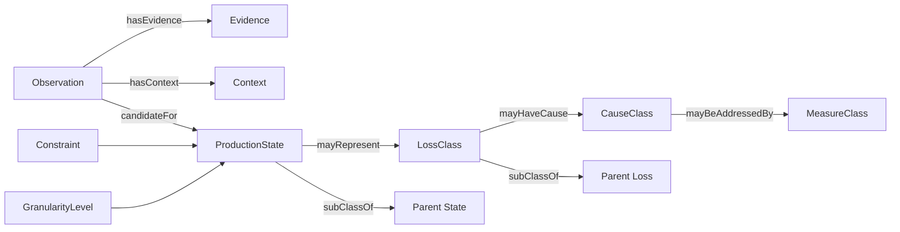
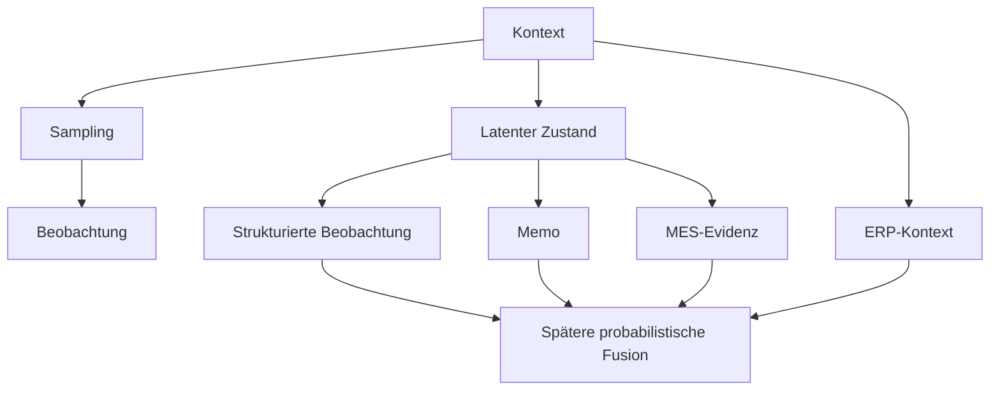

# AP1 – Formale Modellierung des Produktions- und Beobachtungsmodells

**Projekt:** Entwicklung eines unsicherheitsgeführten Mess- und Entscheidungsverfahrens für belastbare Effektivitätskennzahlen und robuste Verbesserungsmaßnahmen in Produktionssystemen  
**Arbeitspaket:** AP1 – Formale Modellierung des Produktions- und Beobachtungsmodells  
**Dokumentstatus:** Überarbeiteter Arbeitsentwurf v0.2  
**Soll-Zeitfenster:** Mai–August 2026  
**Aufwand laut Arbeitsplan:** 585 Stunden  
**Rolle im Gesamtvorhaben:** Fachliche und formale Grundlage für AP2, AP3 und mittelbar AP5

---

## 1. Zweck und Einordnung

AP1 bildet den fachlichen Startpunkt der methodischen Kette. Ziel ist nicht lediglich ein Klassenkatalog, sondern ein formal beschriebenes Produktions- und Beobachtungsmodell, das spätere Annotation, Datenfusion, Kennzahlenschätzung und Unsicherheitsfortführung semantisch trägt.

Der Projektplan fordert für AP1:

- ein ontologisches Fachmodell,
- ein Beobachtungsschema,
- eine generative Struktur für die Sparsity-Erhebung,
- eine Granularitätsanalyse,
- zulässige Klassen, Relationen und Constraints,
- eine begründete Granularitätsentscheidung als Übergabe an AP3.

Noch offen sind insbesondere die konkrete Ontologie-Initialversion, der Klassenkatalog, die Relationen, Constraints, Granularitätskriterien und die Änderungspolitik. Dieses Dokument konkretisiert diese Punkte methodisch und operativ.

---

## 2. Zielbild von AP1

AP1 soll einen belastbaren fachlichen Zustandsraum schaffen, der folgende Anforderungen erfüllt:

1. **Trennung von Beobachtung und tatsächlichem Zustand.** Eine Beobachtung liefert Evidenz, aber keine automatisch wahre Klasse.
2. **Mehrdeutigkeit bleibt zulässig.** Für eine Beobachtung können mehrere Kandidatenklassen bestehen.
3. **Unsicherheit bleibt erhalten.** Nicht ausreichend identifizierbare Fälle dürfen nicht künstlich verfeinert werden.
4. **Hierarchische Rückfallebene.** Feine Klassen müssen auf gröbere Oberklassen zurückgeführt werden können.
5. **Formale Konsistenz.** Relationen, Constraints und Klassenhierarchien sind maschinenlesbar und versioniert.
6. **Anschlussfähigkeit.** AP2 kann das Beobachtungsschema technisch erfassen und AP3 kann daraus zulässige Kandidaten und Constraints ableiten.
7. **Nachvollziehbarkeit.** Granularitätsentscheidungen, Fallbacks und Modelländerungen werden begründet dokumentiert.

Die zentrale fachliche Leitfrage lautet:

> **Welche Granularität ist unter sparsamen, heterogenen und fehlerbehafteten Beobachtungsbedingungen noch belastbar identifizierbar?**

---

## 3. Scope und Abgrenzung

### 3.1 Bestandteil von AP1

AP1 umfasst:

- Begriffs- und Klassenmodell,
- Hierarchisierung der Klassen,
- Relationen und Constraints,
- Beobachtungsschema,
- Evidenz- und Provenienzstruktur,
- formale Beschreibung des Beobachtungsprozesses,
- Granularitäts- und Identifizierbarkeitsanalyse,
- Fallback-Logik,
- Versionierungs- und Änderungspolitik,
- Übergabespezifikation an AP2 und AP3.

### 3.2 Nicht Bestandteil von AP1

Nicht Bestandteil sind:

- Erfassungs-App → **AP2**
- Sprach-/Textklassifikation und Abstain-Logik → **AP3**
- technische MES-/ERP-Anbindung → **AP4**
- bayesianische Mehrkanalfusion → **AP5**
- Kennzahlenschätzung → **AP6**
- End-to-end-Unsicherheitsfortführung → **AP7**
- Wirkungsmodell → **AP8**
- Maßnahmenpriorisierung → **AP9**
- Gesamtvalidierung → **AP10**

AP1 definiert also den fachlichen Möglichkeitsraum, nicht die späteren probabilistischen Schätzverfahren.

---

## 4. Definition of Done

AP1 gilt als abgeschlossen, wenn mindestens folgende Artefakte vorliegen:

- versioniertes ontologisches Fachmodell,
- versionierter Klassenkatalog,
- formales Beobachtungsschema,
- Relationenkatalog,
- Constraint-Katalog,
- dokumentierte Granularitätsentscheidung,
- dokumentierte strittige bzw. nicht identifizierbare Bereiche,
- definierte Fallbacks,
- maschinenlesbare Übergabe an AP2 und AP3,
- nachvollziehbare Versions- und Änderungshistorie.

Für eine konkrete Beobachtung muss AP3 aus AP1 ableiten können:

- welche Klassen zulässig sind,
- welche Klassen ausgeschlossen sind,
- welche Oberklasse als Fallback gilt,
- welche Kontextbedingungen gelten,
- ob eine Situation bewusst als nicht ausreichend identifizierbar behandelt werden muss.

---

## 5. Modellierungsprinzipien

### P1 – Beobachtung ist nicht Wahrheit

Eine Beobachtung ist Evidenz für einen möglichen Zustand, nicht automatisch der tatsächliche Zustand.

### P2 – Mehrere Kandidaten sind zulässig

Eine Beobachtung kann gleichzeitig mehreren fachlich plausiblen Klassen entsprechen.

### P3 – „Unbekannt“ ist ein valider Zustand

Unzureichende Evidenz darf nicht zu einer erzwungenen Feinzuordnung führen.

### P4 – Hierarchie vor Scheingenauigkeit

Wenn die Daten eine feine Klasse nicht tragen, wird auf eine gröbere Ebene zurückgefallen.

### P5 – Provenienz bleibt erhalten

Beobachtung, Memo, MES und ERP bleiben als getrennte Evidenzkanäle nachvollziehbar.

### P6 – Missingness ist explizit

Fehlende Evidenz wird nicht mit negativer Evidenz gleichgesetzt.

### P7 – Ontologie und Schätzmodell bleiben getrennt

AP1 definiert den fachlichen Raum. Wahrscheinlichkeiten werden erst in späteren APs bestimmt.

---

## 6. Formales Metamodell

### 6.1 Kernobjekte

| Objekt | Bedeutung |
|---|---|
| `Observation` | einzelne stichprobenartige Beobachtung |
| `ProductionState` | möglicher Produktions-/Aktivitätszustand |
| `LossClass` | fachlicher Verlusttyp |
| `CauseClass` | mögliche Ursache |
| `MeasureClass` | möglicher Maßnahmentyp |
| `Evidence` | Information aus einem Evidenzkanal |
| `Context` | betrieblicher Kontext |
| `Constraint` | Zulässigkeits-/Ausschlussregel |
| `GranularityLevel` | fachliche Feinheitsstufe |
| `Provenance` | Herkunft und Entstehung einer Information |

### 6.2 Grundrelationen



---

## 7. Trennung von latentem Zustand und Evidenz

Für Beobachtung \(i\) werden konzeptionell unterschieden:

- \(Z_i\): tatsächlicher, nicht direkt beobachtbarer Produktionszustand,
- \(X_i^{obs}\): strukturierte Beobachtung,
- \(X_i^{memo}\): Sprach-/Textmemo,
- \(X_i^{MES}\): MES-Evidenz,
- \(X_i^{ERP}\): ERP-Kontext,
- \(C_i\): Kontext,
- \(S_i\): Sampling-/Stichprobeninformation.

AP1 beschreibt lediglich die formale Struktur:

\[
p(S_i, Z_i, X_i^{obs}, X_i^{memo}, X_i^{MES}, X_i^{ERP}\mid C_i)
\]

Eine mögliche konzeptionelle Faktorisierung lautet:

\[
p(S_i\mid C_i)\cdot p(Z_i\mid C_i)\cdot
\prod_k p(X_i^k\mid Z_i,C_i,Q_i^k)
\]

mit \(Q_i^k\) als Qualitätsinformation des jeweiligen Evidenzkanals.

Diese Struktur ist **kein finales AP5-Modell**, sondern dient ausschließlich dazu, Beobachtung, Kontext, Sampling und latenten Zustand semantisch sauber zu trennen.

---

## 8. Ontologie-Entwurf v0.1

Die folgende Klassenstruktur ist ein **Arbeitsentwurf** für die Granularitätsanalyse und noch kein finales Projektergebnis.

### 8.1 Granularitätsstufen

#### G0 – nicht identifizierbar

- unbekannt / nicht ausreichend bestimmbar

#### G1 – grobe Ebene

- produktiver Zustand
- notwendige unterstützende Tätigkeit
- Verlustzustand
- unbekannt

#### G2 – mittlere Ebene

Beispielhafte Kandidaten:

**Unterstützende Tätigkeiten**
- Rüsten / Umstellen
- Prüfen / Kontrollieren
- notwendiger Transport
- geplante Unterstützung

**Verlustzustände**
- Warten
- Störung / ungeplante Unterbrechung
- Nacharbeit
- ungeplante Instandhaltung
- Leistungsabweichung
- vermeidbare Bewegung / Transport

#### G3 – feine Ebene

Beispielhafte Kandidaten:

- Warten auf Material
- Warten auf Information
- Warten auf Maschine
- Warten auf Personal
- Maschinenstörung
- Prozessstörung
- Nacharbeit aufgrund internem Fehler
- Nacharbeit aufgrund externem Fehler

**Regel:** Eine G3-Klasse wird nur freigegeben, wenn sie mit den vorgesehenen Evidenzkanälen ausreichend trennbar ist.

---

## 9. Verlust-, Ursachen- und Maßnahmenklassen

### 9.1 Verlustklassen – Arbeitsentwurf

- Verfügbarkeitsverlust
- Leistungsverlust
- Qualitätsverlust
- Fluss-/Warteverlust
- Rüst-/Wechselverlust
- vermeidbarer Ressourcen-/Handhabungsverlust
- unbekannter Verlusttyp

Die finale Kennzahlensystematik ist nicht Bestandteil von AP1 und wird erst in AP6 konkretisiert.

### 9.2 Ursachenklassen – Arbeitsentwurf

- Maschine / Anlage / Werkzeug
- Material
- Methode / Prozessgestaltung
- Planung / Information
- Qualitätsproblem im Input
- Logistik / Bereitstellung
- Organisation / Personal
- Umgebung / externer Einfluss
- unbekannte Ursache

Eine Ursache stellt in AP1 eine fachlich zulässige Hypothese dar, keinen Kausalnachweis.

### 9.3 Maßnahmenklassen – Arbeitsentwurf

- Instandhaltung
- Prozessstandardisierung
- Materiallogistik
- Planung / Steuerung
- Qualitätssicherung
- Qualifizierung / Arbeitsorganisation
- Layout / Materialfluss
- technische Automatisierung
- Daten-/Monitoring-Lösung
- zusätzliche Evidenzerhebung

Die Wirkungsbewertung erfolgt erst in AP8/AP9.

---

## 10. Relationenkatalog

| Relation | Quelle | Ziel | Funktion |
|---|---|---|---|
| `subClassOf` | Klasse | Klasse | Hierarchie |
| `candidateFor` | Observation | ProductionState | zulässiger Kandidat |
| `hasEvidence` | Observation | Evidence | Evidenzzuordnung |
| `hasContext` | Observation | Context | Kontextbezug |
| `mayRepresentLoss` | ProductionState | LossClass | möglicher Verlusttyp |
| `mayHaveCause` | LossClass | CauseClass | mögliche Ursache |
| `mayBeAddressedBy` | CauseClass | MeasureClass | mögliche Maßnahme |
| `requiresEvidence` | Klasse | EvidenceType | Evidenzanforderung |
| `requiresContext` | Klasse | ContextCondition | Kontextbedingung |
| `incompatibleWith` | Klasse | Klasse | Ausschlussregel |
| `fallbackTo` | Klasse | Oberklasse | Rückfallregel |

---

## 11. Constraint-Katalog

### C1 – Keine erzwungene Feinzuordnung
Ist eine Blattklasse nicht ausreichend identifizierbar, wird auf eine Oberklasse zurückgefallen.

### C2 – Unbekannt bleibt zulässig
Jede Beobachtung muss als „nicht ausreichend identifizierbar“ behandelbar bleiben.

### C3 – Mehrere Kandidaten sind zulässig
Eine Beobachtung darf mehrere fachlich plausible Klassen besitzen.

### C4 – Hierarchie muss azyklisch sein
Keine Klasse darf direkt oder indirekt ihre eigene Oberklasse sein.

### C5 – Ursache und Zustand bleiben getrennt
Eine vermutete Ursache darf nicht als beobachteter Produktionszustand gespeichert werden.

### C6 – Maßnahme und Zustand bleiben getrennt
Eine Maßnahme darf nicht als beobachtete Klasse erscheinen.

### C7 – Provenienzpflicht
Jede Evidenz muss einem Evidenzkanal und einer Herkunft zugeordnet werden können.

### C8 – Zeitbezug
Jede Beobachtung besitzt einen Zeitpunkt oder ein definiertes Beobachtungsfenster.

### C9 – Missingness ist explizit
Fehlende Daten werden ausdrücklich als fehlend gekennzeichnet.

### C10 – Fallbackpflicht
Jede feine Klasse besitzt eine dokumentierte gröbere Fallbackklasse.

### C11 – Kontextabhängige Zulässigkeit
Klassen, die nur unter bestimmten Prozessbedingungen möglich sind, referenzieren diese Bedingungen explizit.

### C12 – Widersprüche bleiben sichtbar
Konfligierende Evidenzkanäle werden nicht bereits im Beobachtungsschema aufgelöst.

---

## 12. Beobachtungsschema v0.1

### 12.1 Ziel

Das Beobachtungsschema muss stichprobenartige Multimomentaufnahmen unterstützen, ohne eine scheinbar sichere Zielklasse zu erzwingen.

### 12.2 Minimales Schema

| Feld | Typ | Pflicht | Zweck |
|---|---|---:|---|
| `observation_id` | ID | ja | eindeutige Referenz |
| `observed_at` | Timestamp | ja | Beobachtungszeit |
| `observation_window_sec` | Integer | nein | Beobachtungsfenster |
| `sampling_stratum_id` | String | nein | spätere Designauswertung |
| `sampling_cluster_id` | String | nein | Clusterbezug |
| `site_id` | String | nein | Standortkontext |
| `area_id` | String | nein | Bereich |
| `workcenter_id` | String | nein | Arbeitsplatz/Maschine |
| `observer_id` | String/Pseudonym | nein | Provenienz |
| `structured_status` | Enum/List | nein | direkt beobachtete Merkmale |
| `memo_ref` | ID | nein | Sprach-/Textmemo |
| `mes_ref` | ID/List | nein | MES-Verknüpfung |
| `erp_ref` | ID/List | nein | ERP-Verknüpfung |
| `manual_hint_class_ids` | List | nein | Hinweis, keine Wahrheit |
| `manual_confidence` | Float/Ordinal | nein | Unsicherheit des Hinweises |
| `visibility_quality` | Ordinal | ja | Beobachtbarkeit |
| `notes` | Text | nein | Zusatzinformation |
| `schema_version` | String | ja | Reproduzierbarkeit |

### 12.3 Beispiel

```yaml
observation_id: OBS-000184
observed_at: 2026-08-11T10:43:00+02:00
observation_window_sec: 20
sampling_stratum_id: STRATUM-A
sampling_cluster_id: LINE-01
workcenter_id: WC-12
structured_status:
  - machine_stopped
  - operator_waiting
memo_ref: MEMO-000184
mes_ref:
  - MES-EVENT-79231
erp_ref:
  - ORDER-4711
manual_hint_class_ids:
  - PS_WAITING
manual_confidence: 0.6
visibility_quality: medium
schema_version: 0.1.0
```

---

## 13. Generatives Beobachtungsmodell

### 13.1 Entstehungslogik

1. Der Produktionsprozess befindet sich in einem tatsächlichen Zustand.
2. Das Stichprobendesign bestimmt, ob und wann dieser Zustand beobachtet wird.
3. Die Beobachtung erfasst nur einen Ausschnitt.
4. Ein Memo kann zusätzliche semantische Evidenz liefern.
5. MES-Daten liefern technische Zustands-/Ereignisinformation.
6. ERP-Daten liefern Kontext.
7. Jeder Evidenzkanal kann fehlen, fehlerhaft oder mehrdeutig sein.
8. Die spätere Modellkette schätzt daraus eine Verteilung über mögliche Zustände.



### 13.2 Zu dokumentierende Annahmen

- Beobachtungen sind nicht zwingend unabhängig.
- Schichtung und Clusterung sind möglich.
- Beobachtbarkeit ist situationsabhängig.
- Fehlende Evidenz ist keine negative Evidenz.
- Memos können semantisch mehrdeutig sein.
- MES-Zustände und menschliche Beobachtungen können auseinanderfallen.
- ERP-Daten liefern überwiegend Kontext.
- Zeitliche Zuordnungen können fehlerhaft sein.
- Das Modell muss auch bei kleinen Stichproben nutzbar bleiben.

---

## 14. Granularitäts- und Identifizierbarkeitsanalyse

### 14.1 Leitfrage

> Kann eine Kandidatenklasse unter den vorgesehenen Beobachtungsbedingungen ausreichend von benachbarten Klassen unterschieden werden?

### 14.2 Prüfdimensionen

| Kriterium | Leitfrage |
|---|---|
| **K1 Beobachtbarkeit** | Ist die Klasse in einer kurzen Stichprobe grundsätzlich erkennbar? |
| **K2 Semantische Trennschärfe** | Ist die Klasse fachlich klar von Nachbarklassen abgrenzbar? |
| **K3 Zusatz-Evidenz** | Gibt es mindestens einen zusätzlichen Evidenzkanal? |
| **K4 Sparsity-Robustheit** | Ist mit ausreichend vielen Fällen zu rechnen? |
| **K5 Entscheidungsrelevanz** | Hat die Unterscheidung später fachlichen Mehrwert? |
| **K6 Definitionsstabilität** | Lässt sich die Klasse mit Positiv- und Negativbeispielen eindeutig beschreiben? |

### 14.3 Bewertungslogik

Für die Pilotphase wird vorgeschlagen:

- `0` = nicht erfüllt
- `1` = teilweise erfüllt
- `2` = klar erfüllt

Der Score strukturiert die Diskussion, ersetzt aber keine fachliche Freigabe.

Zusätzlich muss jede freizugebende Fein-/Blattklasse besitzen:

- eindeutige Definition,
- Oberklasse,
- Abgrenzung zu Geschwisterklassen,
- Fallbackklasse,
- plausiblen Evidenzpfad,
- fachliche Relevanz.

### 14.4 Mögliche Entscheidungen

- **Beibehalten**
- **Beibehalten unter Annahmen**
- **Aggregieren**
- **Zurückstellen**
- **Nicht identifizierbar**
- **Verwerfen**

---

## 15. Granularitätsmatrix – Muster

| Klasse | Beobachtbarkeit | Trennschärfe | Zusatz-Evidenz | Sparsity | Relevanz | Status |
|---|---:|---:|---:|---:|---:|---|
| Warten auf Material | mittel | mittel | hoch | mittel | hoch | prüfen |
| Warten auf Information | niedrig | mittel | mittel | mittel | hoch | eher aggregieren |
| Maschinenstörung | hoch | hoch | hoch | mittel | hoch | beibehalten |
| Nacharbeit nach internem Fehler | mittel | mittel | mittel | niedrig | hoch | prüfen |

Diese Tabelle ist ein Methodenmuster und kein validiertes Ergebnis.

---

## 16. Test- und Reviewfälle

### Fall A – klarer Grobzustand

**Situation:** Maschine steht, Mitarbeiter wartet sichtbar.  
**Erwartung:** `Warten` ist plausibel; eine Feinursache wird nur bei ausreichender Evidenz zugelassen.

### Fall B – Mehrdeutigkeit

**Situation:** Mitarbeiter steht an Maschine, Bedienpanel geöffnet, kein Memo.  
**Kandidaten:** Rüsten, Störung, ungeplante Instandhaltung.  
**Erwartung:** Keine harte Einzelklasse.

### Fall C – fehlende Kanäle

**Situation:** Beobachtung vorhanden, MES-/ERP-Verknüpfung fehlt.  
**Erwartung:** Beobachtung bleibt gültig; Missingness wird explizit geführt.

### Fall D – konfliktierende Evidenz

**Situation:** Beobachtung deutet auf Warten; MES meldet Maschinenlauf.  
**Erwartung:** Beide Evidenzen bleiben erhalten; AP1 löst den Konflikt nicht vorzeitig auf.

### Fall E – fehlende Feinidentifizierbarkeit

**Situation:** Warten ist eindeutig, Ursache Material vs. Information unklar.  
**Erwartung:** Rückfall auf die Oberklasse `Warten`.

---

## 17. Arbeitspaketstruktur und Stundenverteilung

| Teilpaket | Inhalt | Std. |
|---|---|---:|
| AP1.1 | Anforderungen, Begriffe, Scope und Abgrenzung | 55 |
| AP1.2 | Ontologie-Initialversion und Klassenkatalog | 115 |
| AP1.3 | Beobachtungsschema und Evidenzstruktur | 90 |
| AP1.4 | Generatives Beobachtungs-/Sparsity-Modell | 90 |
| AP1.5 | Granularitäts- und Identifizierbarkeitsanalyse | 110 |
| AP1.6 | Relationen, Constraints und Schnittstellen | 55 |
| AP1.7 | Testfälle, Reviews und Überarbeitung | 40 |
| AP1.8 | Versionierung, Dokumentation und Übergabe | 30 |
|  | **Gesamt** | **585** |

---

## 18. Liefergegenstände

### D1 – Ontologisches Fachmodell v1.0
Klassen-IDs, Bezeichnungen, Definitionen, Hierarchie, Relationen, Granularitätsstufen, Fallbacks, Status.

### D2 – Klassenkatalog v1.0
Definition, Positivbeispiele, Abgrenzungsbeispiele, Oberklasse, Evidenzanforderungen.

### D3 – Beobachtungsschema v1.0
Felddefinitionen, Datentypen, Pflicht-/Optionalfelder, Provenienz, Missingness, Samplinginformationen.

### D4 – Constraint-Katalog v1.0
Zulässigkeitsregeln, Ausschlussregeln, Kontextbedingungen, Fallbacks, Integritätsregeln.

### D5 – Granularitäts- und Identifizierbarkeitsbericht
Kandidatenklassen, Prüfkriterien, Evidenzgrundlage, Entscheidung, Begründung, offene Unsicherheit.

### D6 – Generatives Beobachtungsmodell
Variablen, Abhängigkeiten, Evidenzkanäle, Samplingbezug, dokumentierte Annahmen.

### D7 – AP1-Übergabespezifikation
Verbindliche Schnittstellen für AP2 und AP3.

---

## 19. Traceability-Matrix

| Anforderung | AP1-Artefakt | Nachweis |
|---|---|---|
| Ontologie definieren | D1/D2 | versionierter Klassenbaum |
| Beobachtungsschema definieren | D3 | Schema + Beispieldaten |
| Constraints definieren | D4 | Constraint-Katalog |
| Granularität untersuchen | D5 | Bewertungsmatrix + Entscheidungslog |
| Sparsity modellieren | D6 | formale Struktur + Annahmen |
| Übergabe an AP3 | D7 | Kandidaten-/Fallback-Spezifikation |

---

## 20. Versionierung und Änderungspolitik

### 20.1 Versionsschema

Empfohlen wird semantische Versionierung:

- `MAJOR` – fachlich inkompatible Änderung
- `MINOR` – neue kompatible Klasse oder Relation
- `PATCH` – Dokumentations-/Beschreibungsänderung

Beispiel:

```text
0.1.0  Initialentwurf
0.2.0  nach Fachreview
0.3.0  nach Pilotfällen
1.0.0  freigegebene Übergabe
```

### 20.2 Änderungsprotokoll

Jede Änderung dokumentiert:

1. Änderungsgrund,
2. betroffene Klassen/Relationen,
3. fachliche Begründung,
4. Auswirkungen auf bestehende Daten,
5. Auswirkungen auf AP2/AP3/AP5,
6. Migrationsregel,
7. Freigabestatus.

---

## 21. Empfohlene Ablagestruktur

```text
/ap1
  /ontology
    ontology_v1.yaml
    class_catalog.md
    relations.yaml
  /schema
    observation_schema_v1.yaml
    examples/
  /constraints
    constraints_v1.yaml
  /granularity
    granularity_matrix.csv
    identifiability_report.md
  /tests
    ontology_test_cases.md
  /decisions
    ADR-001-granularity.md
    ADR-002-unknown-fallback.md
    ADR-003-provenance.md
  AP1_handover.md
  CHANGELOG.md
```

---

## 22. Übergabe an AP2

AP2 benötigt insbesondere:

- Beobachtungsschema,
- zulässige Statusfelder,
- Identifikatoren,
- Memo-Verweise,
- Zeit-/Samplingfelder,
- Schema-Version,
- Pflicht-/Optionalfelddefinitionen.

Ziel ist, Beobachtungen erfassen zu können, ohne bereits eine harte Zielklassifikation zu erzwingen.

---

## 23. Übergabe an AP3

AP3 benötigt:

- Ontologie,
- Klassenhierarchie,
- Kandidatenräume,
- Constraints,
- Fallbackklassen,
- Unknown-/Nicht-identifizierbar-Logik,
- Positiv- und Negativbeispiele,
- Kontextbedingungen.

```text
Beobachtung
    ↓
AP1: zulässige Kandidaten + Constraints
    ↓
AP3: Wahrscheinlichkeiten / Abstain
```

---

## 24. Vorwirkung auf AP5

AP5 wird später den latenten Produktionszustand als verborgene Größe probabilistisch schätzen.

AP1 muss deshalb sicherstellen, dass:

- Zustände eindeutig referenzierbar sind,
- Hierarchien explizit sind,
- Evidenzkanäle getrennt bleiben,
- Missingness erlaubt ist,
- Konflikte sichtbar bleiben,
- Beobachtungen nicht bereits als „wahre Klasse“ festgeschrieben werden.

---

## 25. Risiken und Fallbacks

### R1 – Klassen nicht identifizierbar
**Risiko:** Ähnliche Verlustklassen sind mit sparsamen indirekten Daten nicht ausreichend trennbar.  
**Fallback:** Granularität reduzieren, Klassen aggregieren, Oberklasse verwenden, Unsicherheit dokumentieren.

### R2 – Ontologie zu detailliert
**Risiko:** Zu viele Blattklassen erschweren spätere Kalibrierung.  
**Gegenmaßnahme:** Jede Blattklasse durchläuft das Granularitäts-Gate.

### R3 – Definitionen überlappen
**Risiko:** Klassen sind semantisch nicht sauber trennbar.  
**Gegenmaßnahme:** Positiv- und Negativbeispiele sowie Abgrenzungsregeln sind verpflichtend.

### R4 – reale Datenquellen erzwingen Anpassungen
**Risiko:** Konkrete MES-/ERP-Systeme sind noch nicht festgelegt.  
**Gegenmaßnahme:** Evidenzquellen werden abstrakt modelliert und nicht an konkrete Software gebunden.

### R5 – Fachannahmen werden unbemerkt zu technischen Wahrheiten
**Gegenmaßnahme:** Nicht triviale Modellierungsentscheidungen werden als Decision Record dokumentiert.

---

## 26. Qualitäts-Gate

AP1 darf erst freigegeben werden, wenn:

- [ ] alle Klassen stabile IDs besitzen,
- [ ] alle Klassen definiert sind,
- [ ] Hierarchien zyklusfrei sind,
- [ ] feine Klassen eine Fallbackklasse besitzen,
- [ ] `UNKNOWN` / nicht identifizierbar zulässig ist,
- [ ] das Beobachtungsschema keine harte Zielklasse erzwingt,
- [ ] Sampling-/Designinformationen speicherbar sind,
- [ ] Evidenzkanäle getrennt sind,
- [ ] Provenienz speicherbar ist,
- [ ] Missingness explizit behandelt wird,
- [ ] Constraints dokumentiert sind,
- [ ] kritische Granularitätsentscheidungen begründet sind,
- [ ] strittige Bereiche dokumentiert sind,
- [ ] Testfälle erfolgreich durchgespielt wurden,
- [ ] AP2 das Schema implementieren kann,
- [ ] AP3 Kandidaten und Constraints maschinenlesbar beziehen kann,
- [ ] Changelog und Entscheidungsprotokolle vollständig sind.

---

## 27. Konkreter Arbeitsablauf

### Schritt 1 – Begriffe sammeln
Longlist aus Produktionsaktivitäten, Verlustzuständen, Ursachen, Maßnahmen und vorhandenen Begriffssystemen erstellen.

### Schritt 2 – Begriffe bereinigen
Synonyme zusammenführen, mehrdeutige Begriffe markieren und Zustände, Ursachen und Maßnahmen sauber trennen.

### Schritt 3 – Hierarchie aufbauen
Jede Klasse einer Granularitätsstufe und einer Oberklasse zuordnen.

### Schritt 4 – Definitionskarten erstellen

```yaml
id: PS_WAIT_MATERIAL
label_de: Warten auf Material
parent: PS_WAITING
definition: >
  Verlustzustand, bei dem eine vorgesehene Aktivität aufgrund
  nicht verfügbarer Materialien oder Bauteile nicht fortgesetzt werden kann.
positive_examples:
  - Materialbehälter leer; Bediener wartet.
negative_examples:
  - Bediener wartet auf Freigabeinformation.
fallback_to: PS_WAITING
status: draft
```

### Schritt 5 – Beobachtungsschema prüfen
Klare, mehrdeutige, unvollständige und widersprüchliche Fälle testen.

### Schritt 6 – Granularitätsanalyse durchführen
Alle feinen Klassen systematisch bewerten und dokumentieren.

### Schritt 7 – Fachreview durchführen
Definition, Beobachtbarkeit, Trennbarkeit, Evidenzpfad und Relevanz jeder kritischen Klasse prüfen.

### Schritt 8 – Schnittstelle einfrieren
Erste stabile Version veröffentlichen:

- `ontology_v1.0`
- `observation_schema_v1.0`
- `constraints_v1.0`
- `granularity_report_v1.0`

---

## 28. Empfohlene Meilensteine

### M1 – Fachbegriffe und Scope freigegeben
Begriffslandkarte vollständig; Zustände, Ursachen und Maßnahmen getrennt.

### M2 – Ontologie v0.1 verfügbar
Erster Klassenbaum, Relationen und Fallbacks.

### M3 – Beobachtungsschema v0.1 verfügbar
Kernfelder, Evidenzkanäle, Provenienz und Samplinginformationen.

### M4 – Granularitätsreview abgeschlossen
Kritische Klassen bewertet; nicht identifizierbare Klassen markiert; Aggregationen begründet.

### M5 – AP1 v1.0 freigegeben
Artefakte versioniert, Qualitäts-Gate bestanden, Übergabe dokumentiert.

---

## 29. Offene Entscheidungen

Vor Abschluss von AP1 sollten insbesondere folgende Punkte entschieden werden:

1. Welche Produktionsbereiche bilden die Referenz für die Startontologie?
2. Welche G1-Struktur ist fachlich am geeignetsten?
3. Welche G2-Klassen sind branchenübergreifend tragfähig?
4. Welche G3-Klassen sind mit Beobachtung + Memo trennbar?
5. Welche Klassen benötigen zwingend MES-Evidenz?
6. Welche Klassen benötigen ERP-Kontext?
7. Welche Kontextfelder dürfen technisch und datenschutzseitig gespeichert werden?
8. Wie werden seltene, aber entscheidungsrelevante Zustände behandelt?
9. Welche maximale Granularität darf AP3 ausgeben?
10. Wer darf Ontologieänderungen nach AP1-Freigabe beschließen?
11. Wie werden bestehende Beobachtungen bei Ontologieänderungen migriert?
12. Wann wird eine Klasse bewusst nur noch als „nicht identifizierbar“ geführt?

---

## 30. Ergebnisbild

AP1 soll keine möglichst umfangreiche Ontologie erzeugen, sondern eine **prüfbare, versionierte, formal konsistente und unsicherheitsbewusste Fachstruktur**, die:

- Beobachtungen semantisch einordnet,
- mehrere Kandidaten zulässt,
- Unsicherheit nicht abschneidet,
- feine Klassen nur bei ausreichender Evidenz zulässt,
- Fallbacks auf gröbere Klassen ermöglicht,
- Missingness und Provenienz erhält,
- für AP2 technisch implementierbar ist,
- von AP3 probabilistisch genutzt werden kann,
- später als fachlicher Zustandsraum für AP5 dient.

---

## 31. Kurzfassung für die Projektakte

AP1 entwickelt das formale Fach- und Beobachtungsmodell des Vorhabens. Produktionszustände, Verluste, Ursachen und Maßnahmen werden strukturiert, hierarchisiert und über Relationen und Constraints miteinander verbunden. Parallel wird ein Beobachtungsschema definiert, das Multimomentaufnahmen, Memos und spätere MES-/ERP-Evidenz aufnehmen kann, ohne eine harte Zielklasse zu erzwingen.

Ein Schwerpunkt liegt auf der Granularitätsanalyse. Für jede feine Klasse wird geprüft, ob sie unter sparsamen und fehlerbehafteten Beobachtungsbedingungen ausreichend identifizierbar ist. Nicht trennbare Klassen werden aggregiert oder explizit als unsicher geführt. Die Ergebnisse werden versioniert und so an AP2 und AP3 übergeben, dass AP3 pro Beobachtung zulässige Kandidatenklassen, Constraints und Fallbacks beziehen kann.

Die AP1-Liefergegenstände bilden damit die semantische Grundlage für die spätere unsichere Annotation, das latente Mehrkanal-Messmodell und die nachfolgenden Kennzahl- und Entscheidungsstufen.

---

## Quellenbasis und Kennzeichnung

Grundlage dieser Ausarbeitung ist der bereitgestellte Projektplan, insbesondere:

- Zielbild und Architekturprinzip der durchgängigen Unsicherheit,
- AP1 – Formale Modellierung des Produktions- und Beobachtungsmodells,
- technische Unsicherheiten und Fallbacks,
- offene Punkte für die interne Projektkonkretisierung,
- Arbeitsprinzipien und Übergabekontext,
- methodische Verkettung der Arbeitspakete,
- Arbeitsplan mit 585 Stunden für AP1.

Die konkrete Klassenstruktur, interne Meilensteine, Bewertungslogik, Dateistruktur und Versionierung sind **Arbeitsentwürfe zur operativen Konkretisierung** und müssen im Rahmen von AP1 geprüft und freigegeben werden.
