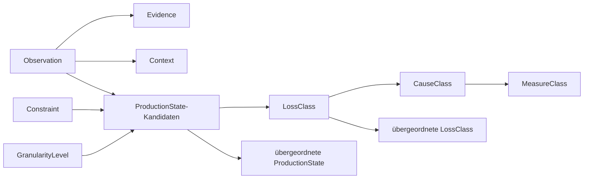
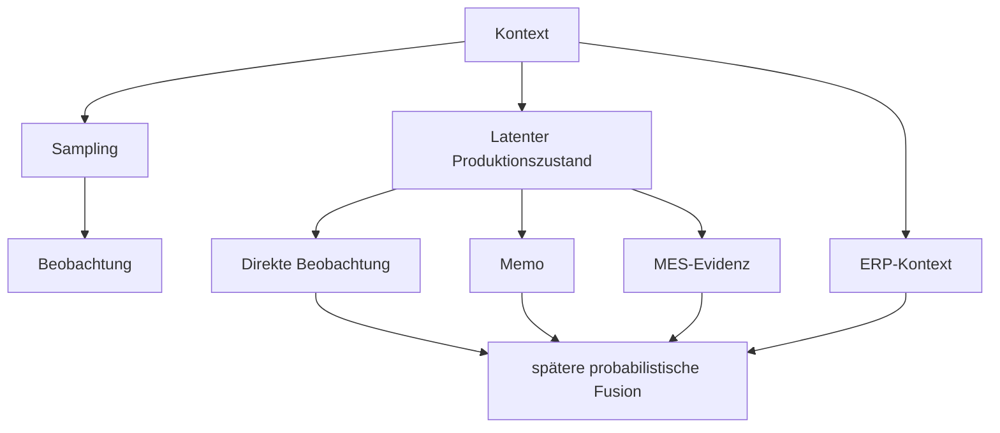

# AP1 – Formale Modellierung des Produktions- und Beobachtungsmodells

**Projekt:** Entwicklung eines unsicherheitsgeführten Mess- und Entscheidungsverfahrens für belastbare Effektivitätskennzahlen und robuste Verbesserungsmaßnahmen in Produktionssystemen  
**Arbeitspaket:** AP1 – Formale Modellierung des Produktions- und Beobachtungsmodells  
**Dokumentstatus:** Überarbeitete Ausarbeitung v0.3  
**Soll-Zeitfenster:** Mai–August 2026  
**Aufwand laut Arbeitsplan:** 585 Stunden  
**Rolle im Gesamtvorhaben:** Methodischer Startpunkt und fachliche Grundlage für AP2, AP3 und später AP5  

---

# 1. Ziel und Zweck von AP1

AP1 schafft die fachliche und formale Grundlage für die gesamte nachfolgende Mess- und Entscheidungskette.

Im Projektplan ist AP1 als **„Formale Modellierung des Produktions- und Beobachtungsmodells“** beschrieben. Dabei sollen insbesondere

- ein ontologisches Fachmodell,
- ein Beobachtungsschema,
- eine generative Struktur für die Sparsity-Erhebung,
- zulässige Klassen, Relationen und Constraints sowie
- eine begründete Granularitätsentscheidung

entwickelt werden.

Die zentrale Aufgabe besteht darin, den fachlichen Zustandsraum so zu definieren, dass spätere Arbeitspakete mit unsicheren und unvollständigen Beobachtungen arbeiten können, ohne bereits in AP1 scheinbar eindeutige Zustände zu unterstellen.

Die Leitfrage von AP1 lautet daher:

> **Welche fachlichen Produktions-, Verlust-, Ursachen- und Maßnahmenklassen können unter sparsamen, heterogenen und fehlerbehafteten Beobachtungsbedingungen sinnvoll unterschieden und für die weiteren Arbeitspakete formal bereitgestellt werden?**

---

# 2. Rolle von AP1 im Gesamtverfahren

AP1 ist der methodische Startpunkt des Hauptpfades:

```text
AP1
 ↓
AP3
 ↓
AP5
 ↓
AP6
 ↓
AP7
 ↓
AP8
 ↓
AP9
 ↓
AP10
```

AP2 und AP4 stellen ergänzende Versuchsinfrastruktur bzw. Datenbedingungen bereit.

Für die nachfolgenden Arbeitspakete bedeutet das:

- **AP2** benötigt ein stabiles Beobachtungsschema.
- **AP3** benötigt Klassen, Hierarchien und Constraints für die probabilistische Annotation.
- **AP5** benötigt einen formal definierten Zustandsraum für das latente Mehrkanal-Messmodell.
- **AP6 ff.** benötigen nachvollziehbare und versionierte Zustandsdefinitionen, um Kennzahlen und Unsicherheiten konsistent fortzuführen.

Damit ist AP1 kein isoliertes Fachmodellierungsprojekt, sondern die **semantische Schnittstelle für die gesamte spätere Modellkette**.

---

# 3. Zielergebnisse von AP1

AP1 soll folgende Ergebnisse liefern:

1. **Ontologisches Fachmodell**
   - Produktions-/Aktivitätsklassen
   - Verlustklassen
   - Ursachenklassen
   - Maßnahmenklassen
   - Hierarchien und Relationen

2. **Beobachtungsschema**
   - Struktur einer Multimomentaufnahme
   - Kontextinformationen
   - Evidenzkanäle
   - Zeitbezug
   - Provenienz
   - Missingness

3. **Constraint-Modell**
   - zulässige Kombinationen
   - unzulässige Kombinationen
   - Kontextbedingungen
   - Fallback-Regeln

4. **Generatives Beobachtungsmodell**
   - formale Beschreibung, wie aus einem tatsächlichen Produktionszustand beobachtbare Evidenz entsteht

5. **Granularitäts- und Identifizierbarkeitsanalyse**
   - Prüfung, welche Klassen mit den später verfügbaren Evidenzkanälen trennbar sind

6. **Versionierte Übergabespezifikation**
   - maschinenlesbare Grundlage für AP2 und AP3

---

# 4. Abgrenzung von AP1

## 4.1 Bestandteil von AP1

AP1 umfasst:

- Definition und Strukturierung der fachlichen Begriffe,
- Entwicklung des Klassenmodells,
- Definition der Klassenhierarchien,
- Definition von Relationen und Constraints,
- Definition des Beobachtungsschemas,
- Abbildung der vorgesehenen Evidenzkanäle,
- Beschreibung des Beobachtungsprozesses,
- Granularitätsanalyse,
- Identifizierbarkeitsanalyse,
- Dokumentation von Fallbacks,
- Versionierung und Übergabe.

## 4.2 Nicht Bestandteil von AP1

Nicht Bestandteil von AP1 sind:

| Thema | Zuständiges AP |
|---|---|
| Entwicklung der Erfassungs-App | AP2 |
| Sprach-/Text-zu-Ontologie-Zuordnung | AP3 |
| Kalibrierung von Klassenwahrscheinlichkeiten | AP3 |
| MES-/ERP-Anbindung | AP4 |
| Bayesianische Datenfusion | AP5 |
| Kennzahlenschätzung | AP6 |
| End-to-end-Unsicherheitspropagation | AP7 |
| Wirkungsmodell | AP8 |
| Maßnahmenpriorisierung | AP9 |
| Gesamtvalidierung | AP10 |

Diese Abgrenzung ist wichtig, damit AP1 nicht bereits Methoden oder Annahmen vorwegnimmt, die bewusst erst in späteren Arbeitspaketen entwickelt werden sollen.

---

# 5. Grundprinzipien der Modellierung

## 5.1 Beobachtung ist nicht gleich tatsächlicher Zustand

Eine Multimomentaufnahme erfasst nur einen Ausschnitt der Realität.

Daher gilt:

```text
Beobachtung ≠ tatsächlicher Produktionszustand
```

Die Beobachtung liefert lediglich Evidenz für mögliche Zustände.

## 5.2 Mehrere Kandidaten müssen zulässig sein

Eine einzelne Beobachtung kann mehrere plausible Interpretationen besitzen.

Beispiel:

```text
Beobachtung:
Maschine steht.
Mitarbeiter befindet sich am Bedienpanel.

Mögliche Zustände:
- Rüsten
- Störung
- ungeplante Instandhaltung
```

AP1 darf hier keine künstliche Eindeutigkeit erzwingen.

## 5.3 Unsicherheit ist ein gültiges Ergebnis

Wenn eine Beobachtung nicht ausreichend trennscharf ist, muss das Modell dies explizit zulassen.

Mögliche Ergebnisse sind daher:

- feine Klasse,
- gröbere Oberklasse,
- mehrere Kandidaten,
- unbekannt,
- nicht ausreichend identifizierbar.

## 5.4 Granularität folgt der Evidenz

Eine Klasse darf nur so fein modelliert werden, wie sie unter den vorgesehenen Beobachtungsbedingungen noch belastbar unterscheidbar ist.

> **Nicht die fachlich maximal denkbare Granularität ist das Ziel, sondern die mit den vorhandenen Evidenzkanälen tragfähige Granularität.**

## 5.5 Provenienz bleibt erhalten

Jede Information muss auf ihre Herkunft zurückführbar sein:

- direkte Beobachtung,
- Sprach-/Textmemo,
- MES-Daten,
- ERP-Daten,
- abgeleitete Information.

---

# 6. Formales Metamodell

## 6.1 Kernobjekte

| Objekt | Beschreibung |
|---|---|
| `Observation` | einzelne stichprobenartige Beobachtung |
| `ProductionState` | möglicher Produktions-/Aktivitätszustand |
| `LossClass` | möglicher Verlusttyp |
| `CauseClass` | mögliche Ursache |
| `MeasureClass` | möglicher Maßnahmentyp |
| `Evidence` | Information aus einem Evidenzkanal |
| `Context` | betrieblicher Kontext |
| `Constraint` | fachliche Zulässigkeitsregel |
| `GranularityLevel` | Granularitätsstufe |
| `Provenance` | Herkunft einer Information |

## 6.2 Beziehungen



---

# 7. Formale Trennung von Zustand und Evidenz

Für eine Beobachtung \(i\) werden folgende Variablen unterschieden:

- \(Z_i\): tatsächlicher, latenter Produktionszustand,
- \(X_i^{obs}\): direkte Beobachtung,
- \(X_i^{memo}\): Memo-Evidenz,
- \(X_i^{MES}\): MES-Evidenz,
- \(X_i^{ERP}\): ERP-Kontext,
- \(C_i\): Kontext,
- \(S_i\): Samplinginformation.

Konzeptionell wird damit eine Struktur der Form

\[
p(S_i, Z_i, X_i^{obs}, X_i^{memo}, X_i^{MES}, X_i^{ERP}\mid C_i)
\]

angenommen.

Für die spätere Modellierung kann beispielsweise folgende Struktur geprüft werden:

\[
p(S_i\mid C_i)
\cdot p(Z_i\mid C_i)
\cdot
\prod_k p(X_i^k\mid Z_i,C_i,Q_i^k)
\]

mit \(Q_i^k\) als Qualitätsinformation des jeweiligen Evidenzkanals.

Diese Struktur ist **noch kein finales statistisches Modell**. In AP1 dient sie dazu, die Rollen der Informationen formal voneinander zu trennen.

---

# 8. Ontologie – vorgeschlagene Startstruktur

Die nachfolgende Ontologie ist ein Arbeitsentwurf für die AP1-Analyse. Der Projektplan legt keine finale Klassenliste fest.

## 8.1 Granularitätsstufen

### G0 – Nicht identifizierbar

- `UNKNOWN`

### G1 – Grobe Zustandsklassen

- `PRODUCTIVE`
- `NECESSARY_SUPPORT`
- `LOSS`
- `UNKNOWN`

### G2 – Mittlere Zustandsklassen

**Notwendige Unterstützung**
- `SETUP`
- `INSPECTION`
- `NECESSARY_TRANSPORT`
- `PLANNED_SUPPORT`

**Verlustzustände**
- `WAITING`
- `DISTURBANCE`
- `REWORK`
- `UNPLANNED_MAINTENANCE`
- `PERFORMANCE_DEVIATION`
- `UNNECESSARY_MOTION_OR_TRANSPORT`

### G3 – mögliche Feinklassen

Beispielsweise:

- `WAIT_MATERIAL`
- `WAIT_INFORMATION`
- `WAIT_MACHINE`
- `WAIT_PERSONNEL`
- `DISTURB_MACHINE`
- `DISTURB_PROCESS`
- `REWORK_INTERNAL`
- `REWORK_EXTERNAL`

G3-Klassen dürfen erst dann Bestandteil der freigegebenen Ontologie werden, wenn sie die Granularitätsprüfung bestehen.

---

# 9. Verlustklassen

Als initiale Verlustfamilien können geprüft werden:

- Verfügbarkeitsverlust
- Leistungsverlust
- Qualitätsverlust
- Fluss-/Warteverlust
- Rüst-/Wechselverlust
- vermeidbarer Ressourcen-/Handhabungsverlust
- unbekannter Verlusttyp

Die finale Kennzahlendefinition erfolgt erst in AP6.

---

# 10. Ursachenklassen

Als initiale Ursachenfamilien können geprüft werden:

- Maschine / Anlage / Werkzeug
- Material
- Methode / Prozessgestaltung
- Planung / Information
- Qualität des Inputs
- Logistik / Bereitstellung
- Organisation / Personal
- Umgebung / externe Einflüsse
- unbekannte Ursache

Eine Ursachenklasse ist in AP1 lediglich eine **fachlich zulässige Hypothese** und kein Kausalnachweis.

---

# 11. Maßnahmenklassen

Als initiale Maßnahmenfamilien können geprüft werden:

- Instandhaltung
- Prozessstandardisierung
- Materiallogistik
- Planung und Steuerung
- Qualitätssicherung
- Qualifizierung / Arbeitsorganisation
- Layout / Materialfluss
- technische Automatisierung
- Daten-/Monitoring-Lösung
- zusätzliche Evidenzerhebung

Die Wirkung oder Priorität dieser Maßnahmen wird nicht in AP1 bestimmt.

---

# 12. Relationenkatalog

| Relation | Quelle | Ziel | Bedeutung |
|---|---|---|---|
| `subClassOf` | Klasse | Klasse | Hierarchie |
| `candidateFor` | Observation | ProductionState | zulässige Kandidatenklasse |
| `hasEvidence` | Observation | Evidence | Evidenzzuordnung |
| `hasContext` | Observation | Context | Kontextbezug |
| `mayRepresentLoss` | ProductionState | LossClass | möglicher Verlust |
| `mayHaveCause` | LossClass | CauseClass | mögliche Ursache |
| `mayBeAddressedBy` | CauseClass | MeasureClass | mögliche Maßnahme |
| `requiresEvidence` | Klasse | EvidenceType | erforderlicher Evidenztyp |
| `requiresContext` | Klasse | ContextCondition | Kontextbedingung |
| `incompatibleWith` | Klasse | Klasse | Ausschlussregel |
| `fallbackTo` | Klasse | Oberklasse | Rückfallregel |

---

# 13. Constraint-Katalog

- **C01 – Keine erzwungene Feinzuordnung:** Eine feine Klasse darf nur ausgegeben werden, wenn die notwendige Evidenz vorhanden ist.
- **C02 – UNKNOWN ist immer zulässig:** Eine Beobachtung darf als nicht ausreichend identifizierbar markiert werden.
- **C03 – Kandidatenmenge statt Pflicht-Einzelklasse:** Für eine Beobachtung können mehrere Kandidatenklassen zulässig sein.
- **C04 – Hierarchie ist azyklisch:** Eine Klasse darf weder direkt noch indirekt ihre eigene Oberklasse sein.
- **C05 – Ursache und Zustand sind getrennt:** Eine vermutete Ursache darf nicht als Produktionszustand verwendet werden.
- **C06 – Maßnahme und Zustand sind getrennt:** Eine mögliche Maßnahme ist keine Beobachtungsklasse.
- **C07 – Provenienzpflicht:** Jede Evidenz muss eine dokumentierte Herkunft besitzen.
- **C08 – Zeitbezug:** Jede Beobachtung besitzt einen Beobachtungszeitpunkt oder ein Beobachtungsfenster.
- **C09 – Missingness bleibt sichtbar:** Fehlende Daten werden nicht als negatives Ereignis interpretiert.
- **C10 – Fallbackpflicht:** Jede Feinklasse besitzt eine definierte Rückfallklasse.
- **C11 – Kontextabhängige Klassen:** Klassen mit Kontextbedingungen referenzieren diese Bedingungen explizit.
- **C12 – Konfligierende Evidenz bleibt bestehen:** Widersprüche zwischen Beobachtung, Memo, MES oder ERP werden nicht bereits in AP1 aufgelöst.

---

# 14. Beobachtungsschema

## 14.1 Ziel

Das Beobachtungsschema soll eine sparsame Multimomentaufnahme vollständig genug beschreiben, um sie später gemeinsam mit Memos und MES-/ERP-Evidenz auszuwerten. Gleichzeitig darf das Schema keine harte fachliche Wahrheit erzwingen.

## 14.2 Kernfelder

| Feld | Typ | Pflicht | Funktion |
|---|---|---:|---|
| `observation_id` | ID | ja | eindeutige Beobachtung |
| `observed_at` | Timestamp | ja | Beobachtungszeitpunkt |
| `observation_window_sec` | Integer | nein | Beobachtungsfenster |
| `sampling_stratum_id` | String | nein | Schichtinformation |
| `sampling_cluster_id` | String | nein | Clusterinformation |
| `site_id` | String | nein | Standort |
| `area_id` | String | nein | Bereich |
| `workcenter_id` | String | nein | Arbeitsplatz / Maschine |
| `observer_id` | String/Pseudonym | nein | Beobachter-Provenienz |
| `structured_status` | Liste | nein | direkt sichtbare Merkmale |
| `memo_ref` | ID | nein | Sprach-/Textmemo |
| `mes_ref` | ID/Liste | nein | MES-Verknüpfung |
| `erp_ref` | ID/Liste | nein | ERP-Verknüpfung |
| `manual_hint_class_ids` | Liste | nein | fachlicher Hinweis |
| `manual_confidence` | Float/Ordinal | nein | subjektive Sicherheit |
| `visibility_quality` | Ordinal | ja | Qualität der Beobachtbarkeit |
| `notes` | Text | nein | weitere Hinweise |
| `schema_version` | String | ja | Version des Schemas |

## 14.3 Beispiel

```yaml
observation_id: OBS-000184
observed_at: 2026-08-11T10:43:00+02:00
observation_window_sec: 20
sampling_stratum_id: STRATUM-A
sampling_cluster_id: LINE-01
workcenter_id: WC-12
structured_status:
  - machine_stopped
  - operator_waiting
memo_ref: MEMO-000184
mes_ref:
  - MES-EVENT-79231
erp_ref:
  - ORDER-4711
manual_hint_class_ids:
  - WAITING
manual_confidence: 0.6
visibility_quality: medium
schema_version: 0.1.0
```

`manual_hint_class_ids` ist ausdrücklich kein Ground-Truth-Label.

---

# 15. Generatives Beobachtungsmodell

## 15.1 Grundlogik

1. Der Produktionsprozess befindet sich in einem tatsächlichen Zustand.
2. Das Sampling bestimmt, ob und wann dieser Zustand beobachtet wird.
3. Die direkte Beobachtung bildet nur einen Ausschnitt ab.
4. Memos liefern zusätzliche semantische Evidenz.
5. MES liefert Maschinenzustände und Ereignisse.
6. ERP liefert Auftrags- und Produktkontext.
7. Alle Kanäle können fehlen oder fehlerhaft sein.
8. Erst spätere Arbeitspakete fusionieren diese Evidenzen probabilistisch.



---

# 16. Granularitäts- und Identifizierbarkeitsanalyse

Die Granularitätsanalyse ist der zentrale methodische Untersuchungsgegenstand von AP1.

Für jede vorgeschlagene Feinklasse ist zu prüfen:

> **Kann die Klasse mit den vorgesehenen Evidenzkanälen unter sparsamen Beobachtungsbedingungen ausreichend von benachbarten Klassen unterschieden werden?**

## 16.1 Prüfdimensionen

| Kriterium | Leitfrage |
|---|---|
| K1 – Beobachtbarkeit | Ist die Klasse in einer kurzen Stichprobe grundsätzlich erkennbar? |
| K2 – Trennschärfe | Ist sie fachlich von Geschwisterklassen unterscheidbar? |
| K3 – zusätzliche Evidenz | Können Memo, MES oder ERP die Unterscheidung unterstützen? |
| K4 – Sparsity-Robustheit | Ist mit genügend Fällen zu rechnen? |
| K5 – Entscheidungsrelevanz | Hat die zusätzliche Feinheit später einen Nutzen? |
| K6 – Definitionsstabilität | Kann die Klasse eindeutig beschrieben werden? |
| K7 – Fallback-Fähigkeit | Existiert eine sinnvolle Oberklasse? |

## 16.2 Bewertungslogik

Für die Pilotphase kann je Kriterium folgende Skala verwendet werden:

```text
0 = nicht erfüllt
1 = teilweise erfüllt
2 = klar erfüllt
```

Der Score strukturiert die Diskussion, ist aber **kein automatischer Freigabemechanismus**.

## 16.3 Freigabemöglichkeiten

Für jede Klasse wird eine dokumentierte Entscheidung getroffen:

- **Beibehalten**
- **Beibehalten unter Annahmen**
- **Aggregieren**
- **Zurückstellen**
- **Nicht identifizierbar**
- **Verwerfen**

## 16.4 Beispiel

| Klasse | Beobachtbarkeit | Trennschärfe | Zusatz-Evidenz | Sparsity | Relevanz | Entscheidung |
|---|---|---|---|---|---|---|
| Warten auf Material | mittel | mittel | hoch | mittel | hoch | prüfen |
| Warten auf Information | niedrig | mittel | mittel | mittel | hoch | eher aggregieren |
| Maschinenstörung | hoch | hoch | hoch | mittel | hoch | beibehalten |
| interne Nacharbeit | mittel | mittel | mittel | niedrig | hoch | prüfen |

Die Werte sind nur Beispiele für die Anwendung der Methode.

---

# 17. Testfälle

## Testfall 1 – eindeutiger Grobzustand

**Beobachtung:** Maschine steht. Mitarbeiter wartet.  
**Erwartung:** `WAITING` ist zulässig. Eine feinere Ursache wird nicht ohne zusätzliche Evidenz vergeben.

## Testfall 2 – mehrdeutiger Zustand

**Beobachtung:** Maschine steht. Mitarbeiter arbeitet am Bedienpanel.  
**Kandidaten:** `SETUP`, `DISTURBANCE`, `UNPLANNED_MAINTENANCE`.  
**Erwartung:** Mehrere Kandidaten bleiben zulässig.

## Testfall 3 – fehlender Datenkanal

**Beobachtung:** Direkte Beobachtung vorhanden, MES nicht verfügbar.  
**Erwartung:** Die Beobachtung bleibt gültig. MES wird als fehlend markiert.

## Testfall 4 – widersprüchliche Evidenz

**Beobachtung:** Beobachter meldet „Warten“. MES meldet Maschinenlauf.  
**Erwartung:** Beide Evidenzen bleiben erhalten. Die Auflösung erfolgt nicht in AP1.

## Testfall 5 – Feinursache nicht identifizierbar

**Beobachtung:** Warten ist erkennbar. Ob Material oder Information fehlt, ist unklar.  
**Erwartung:** Ausgabe auf Ebene `WAITING`.

---

# 18. Arbeitspaketstruktur und Aufwand

Die 585 Stunden werden für die operative Projektsteuerung wie folgt aufgeteilt:

| Teilpaket | Inhalt | Aufwand |
|---|---|---:|
| AP1.1 | Anforderungen, Begriffe, Scope | 55 h |
| AP1.2 | Ontologie und Klassenkatalog | 115 h |
| AP1.3 | Beobachtungsschema | 90 h |
| AP1.4 | Generatives Beobachtungsmodell | 90 h |
| AP1.5 | Granularitäts- und Identifizierbarkeitsanalyse | 110 h |
| AP1.6 | Relationen, Constraints und Schnittstellen | 55 h |
| AP1.7 | Testfälle und Reviews | 40 h |
| AP1.8 | Dokumentation und Übergabe | 30 h |
| **Gesamt** |  | **585 h** |

---

# 19. Arbeitsschritte und Ergebnisse

| Teilpaket | Kernarbeiten | Ergebnis |
|---|---|---|
| AP1.1 | Anforderungen strukturieren, Begriffe sammeln, Synonyme bereinigen, Scope abgrenzen | `concept_longlist_v0.1` |
| AP1.2 | Klassenhierarchie, IDs, Definitionen, Positiv-/Negativbeispiele | `ontology_v0.1` |
| AP1.3 | Beobachtungsfelder, Pflicht-/Optionalfelder, Provenienz, Sampling | `observation_schema_v0.1` |
| AP1.4 | latenter Zustand, Evidenzkanäle, Sampling, Missingness | `generative_observation_model_v0.1` |
| AP1.5 | Trennschärfe prüfen, Evidenzbedarf bestimmen, Fallbacks definieren | `granularity_report_v0.1` |
| AP1.6 | Relationen, Constraints, maschinenlesbare Schnittstellen | `constraints_v0.1` |
| AP1.7 | Test-, Grenz- und Konfliktfälle prüfen | `ap1_test_report` |
| AP1.8 | finale Versionierung, Changelog und Übergabe | `AP1_release_v1.0` |

---

# 20. Liefergegenstände

## D1 – Ontologisches Fachmodell
Klassen, Hierarchien, Relationen, stabile IDs, Granularitätsstufen und Fallbacks.

## D2 – Klassenkatalog
Für jede Klasse: ID, Bezeichnung, Definition, Oberklasse, Positivbeispiele, Negativbeispiele, Evidenzanforderungen und Status.

## D3 – Beobachtungsschema
Felddefinitionen, Datentypen, Pflichtfelder, Samplinginformationen, Evidenzverweise, Missingness und Provenienz.

## D4 – Constraint-Katalog
Zulässigkeitsregeln, Ausschlussregeln, Kontextbedingungen, Fallbackregeln und Integritätsregeln.

## D5 – Granularitätsbericht
Untersuchte Klassen, Prüfkriterien, Evidenzlage, Entscheidung, Begründung und offene Unsicherheit.

## D6 – Generatives Beobachtungsmodell
Zustandsvariablen, Evidenzkanäle, Samplingstruktur, Qualitätsannahmen und Missingness-Annahmen.

## D7 – AP1-Übergabespezifikation
Verbindliche Klassen-IDs, Kandidatenräume, Constraints, Fallbacks und Versionsinformationen.

---

# 21. Traceability

| Projektanforderung | Ergebnis | Nachweis |
|---|---|---|
| Ontologie erstellen | D1/D2 | Klassenbaum und Katalog |
| Beobachtungsschema erstellen | D3 | Schema + Testdaten |
| Constraints definieren | D4 | Constraint-Katalog |
| Granularität analysieren | D5 | Granularitätsmatrix |
| Sparsity-Struktur modellieren | D6 | generatives Modell |
| AP3 vorbereiten | D7 | Übergabespezifikation |

---

# 22. Qualitäts-Gates

## Gate G1 – Begriffsmodell
Erfüllt, wenn Zustände, Verluste, Ursachen und Maßnahmen getrennt, Synonyme bereinigt und zentrale Begriffe definiert sind.

## Gate G2 – Ontologie
Erfüllt, wenn jede Klasse eine ID und Definition besitzt, die Hierarchie zyklusfrei ist und jede Feinklasse einen Fallback besitzt.

## Gate G3 – Beobachtungsschema
Erfüllt, wenn Beobachtungen ohne harte Zielklasse gespeichert werden können, Missingness zulässig ist, Provenienz erhalten bleibt und Samplinginformationen aufgenommen werden können.

## Gate G4 – Granularität
Erfüllt, wenn kritische Klassen bewertet, nicht identifizierbare Klassen dokumentiert und Aggregationen begründet sind.

## Gate G5 – Übergabe
Erfüllt, wenn AP2 das Schema implementieren und AP3 Kandidaten sowie Constraints maschinenlesbar beziehen kann.

---

# 23. Meilensteine

| Meilenstein | Ergebnis |
|---|---|
| M1 | Begriffsmodell und Scope freigegeben |
| M2 | Ontologie v0.1 verfügbar |
| M3 | Beobachtungsschema v0.1 verfügbar |
| M4 | Granularitätsanalyse abgeschlossen |
| M5 | AP1 v1.0 freigegeben und an AP2/AP3 übergeben |

---

# 24. Versionierung und Änderungspolitik

Empfohlen wird semantische Versionierung:

```text
0.1.0  Initialentwurf
0.2.0  nach Fachreview
0.3.0  nach Testfällen
1.0.0  freigegebene AP1-Version
```

Bedeutung:

- `MAJOR` – inkompatible fachliche Änderung
- `MINOR` – neue kompatible Klasse oder Relation
- `PATCH` – Dokumentationsänderung

Jede Änderung dokumentiert mindestens:

1. Änderungsgrund,
2. betroffene Klassen,
3. fachliche Begründung,
4. Auswirkungen auf bestehende Beobachtungen,
5. Auswirkungen auf AP2/AP3/AP5,
6. Migrationsregel,
7. Freigabestatus.

---

# 25. Empfohlene Ablagestruktur

```text
/AP1
├── ontology/
│   ├── ontology_v1.yaml
│   ├── class_catalog.md
│   └── relations.yaml
├── schema/
│   ├── observation_schema_v1.yaml
│   └── examples/
├── constraints/
│   └── constraints_v1.yaml
├── granularity/
│   ├── granularity_matrix.csv
│   └── identifiability_report.md
├── tests/
│   └── ontology_test_cases.md
├── decisions/
│   ├── ADR-001-granularity.md
│   ├── ADR-002-fallback.md
│   └── ADR-003-provenance.md
├── AP1_handover.md
└── CHANGELOG.md
```

---

# 26. Übergabe an AP2

AP2 erhält:

- Beobachtungsschema,
- Felddefinitionen,
- Statusfelder,
- Samplingfelder,
- Memo-Referenz,
- Zeitinformationen,
- Schema-Version.

AP2 soll damit Beobachtungen erfassen können, ohne eine Zielklasse zu erzwingen.

---

# 27. Übergabe an AP3

AP3 erhält:

- Ontologie,
- Klassenhierarchie,
- Kandidatenräume,
- Constraints,
- Fallbackklassen,
- UNKNOWN-Logik,
- Positiv-/Negativbeispiele,
- Kontextbedingungen.

```text
Beobachtung
     ↓
AP1:
zulässige Klassen
+ Hierarchie
+ Constraints
+ Fallbacks
     ↓
AP3:
probabilistische Klassenwahrscheinlichkeiten
oder Abstain
```

---

# 28. Risiken und Fallbacks

## R1 – Klassen nicht identifizierbar
**Risiko:** Feine Klassen lassen sich mit sparsamen Daten nicht auseinanderhalten.  
**Fallback:** Klassen aggregieren, Oberklasse verwenden und Unsicherheitsbereich dokumentieren.

## R2 – Ontologie zu detailliert
**Risiko:** Zu viele Klassen führen zu schlecht trennbaren Annotationen.  
**Gegenmaßnahme:** Jede Blattklasse muss die Granularitätsprüfung bestehen.

## R3 – Klassen überlappen fachlich
**Risiko:** Definitionen sind nicht eindeutig genug.  
**Gegenmaßnahme:** Jede Klasse benötigt Definition, Positivbeispiel, Negativbeispiel und Abgrenzung.

## R4 – reale MES-/ERP-Strukturen passen nicht zur Ontologie
**Risiko:** Die konkreten Datenquellen sind im Projektplan noch nicht festgelegt.  
**Gegenmaßnahme:** Evidenzkanäle werden in AP1 abstrakt modelliert.

## R5 – implizite Annahmen werden später als Wahrheit behandelt
**Gegenmaßnahme:** Nicht triviale Modellentscheidungen werden in Decision Records dokumentiert.

---

# 29. Offene Entscheidungen für AP1

Vor der finalen Freigabe müssen mindestens folgende Punkte geklärt werden:

1. Welche Produktionsbereiche dienen als Referenz für die Startontologie?
2. Welche G1-Struktur wird verwendet?
3. Welche G2-Klassen sind branchenübergreifend tragfähig?
4. Welche G3-Klassen sind mit Beobachtung und Memo trennbar?
5. Welche Klassen benötigen MES-Evidenz?
6. Welche Klassen benötigen ERP-Kontext?
7. Welche Kontextinformationen dürfen gespeichert werden?
8. Wie werden seltene Klassen behandelt?
9. Welche maximale Granularität darf AP3 ausgeben?
10. Wer darf Ontologieänderungen freigeben?
11. Wie werden Daten bei Ontologieänderungen migriert?
12. Welche Kriterien lösen den Fallback auf eine gröbere Klasse aus?

---

# 30. Definition of Done – finale Checkliste

- [ ] Ontologie versioniert
- [ ] Klassenkatalog vollständig
- [ ] stabile Klassen-IDs vorhanden
- [ ] alle Klassen definiert
- [ ] Hierarchien konsistent
- [ ] Feinklassen mit Fallbacks versehen
- [ ] UNKNOWN zulässig
- [ ] Beobachtungsschema freigegeben
- [ ] Evidenzkanäle getrennt modelliert
- [ ] Provenienz erhalten
- [ ] Missingness explizit behandelt
- [ ] Constraints dokumentiert
- [ ] Granularitätsanalyse durchgeführt
- [ ] nicht identifizierbare Klassen dokumentiert
- [ ] Testfälle durchgeführt
- [ ] AP2 kann das Schema übernehmen
- [ ] AP3 kann Kandidaten und Constraints beziehen
- [ ] AP1-Version v1.0 freigegeben
- [ ] Changelog und Entscheidungsdokumentation vollständig

---

# 31. Kurzfassung für die Projektakte

AP1 entwickelt das formale Produktions- und Beobachtungsmodell des Vorhabens. Produktionszustände, Verluste, Ursachen und Maßnahmen werden strukturiert, hierarchisiert und über Relationen und Constraints miteinander verbunden. Parallel wird ein Beobachtungsschema definiert, das Multimomentaufnahmen, Memos sowie spätere MES-/ERP-Evidenz aufnehmen kann, ohne eine harte Zielklasse vorzugeben.

Der zentrale methodische Schwerpunkt ist die Granularitäts- und Identifizierbarkeitsanalyse. Für jede feine Klasse wird geprüft, ob sie unter sparsamen, heterogenen und fehlerbehafteten Beobachtungsbedingungen ausreichend unterscheidbar ist. Nicht trennbare Klassen werden aggregiert oder als nicht identifizierbar dokumentiert.

Die Ergebnisse werden versioniert und so an AP2 und AP3 übergeben, dass AP3 für jede Beobachtung zulässige Kandidatenklassen, Constraints und Fallbacks beziehen kann.

AP1 schafft damit die semantische Grundlage für die spätere unsichere Annotation, das latente Mehrkanal-Messmodell und die nachfolgenden Kennzahl-, Wirkungs- und Entscheidungsstufen.

---

# 32. Quellenbasis und Abgrenzung der Ausarbeitung

Diese Ausarbeitung basiert auf dem bereitgestellten Projektplan, insbesondere auf:

- Zielbild und Architekturprinzip,
- AP1 – Formale Modellierung des Produktions- und Beobachtungsmodells,
- methodischer Verkettung der Arbeitspakete,
- technischen Unsicherheiten und Fallbacks,
- offenen Punkten für die interne Projektkonkretisierung,
- Arbeitsprinzipien für die Umsetzung,
- Arbeitsplan mit 585 Stunden für AP1.

Die konkrete Ontologie, Klassenbeispiele, interne Stundenverteilung, Bewertungslogik, Meilensteine, Qualitäts-Gates und Dateistruktur sind **operative Arbeitsentwürfe**. Sie sind nicht als bereits festgelegte Inhalte des ursprünglichen Projektauftrags zu verstehen und müssen innerhalb von AP1 fachlich validiert und freigegeben werden.
